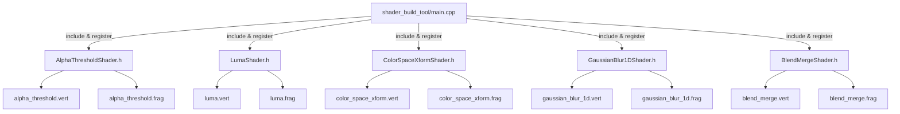

## Product Overview

为 TGFX Shader Permutation 系统补全更多 Shader 声明（阶段四扩展覆盖），新增 5 个预编译 Shader 类及其对应的 GLSL 模板文件，并注册到 shader_build_tool 中。

## Core Features

- 新增 `AlphaThresholdShader`：alpha 阈值步进效果，无排列维度，仅 1 个变体
- 新增 `LumaShader`：亮度提取效果，无排列维度，仅 1 个变体（LumaFactor 通过 uniform 传入）
- 新增 `ColorSpaceXformShader`：色空间转换效果，7 个 bool flag 维度 + 2 个 TF type 维度，通过 ShouldCompile 裁剪到约 20~30 个有效变体
- 新增 `GaussianBlur1DShader`：一维高斯模糊效果，MAX_SIGMA 整数维度(1~10)，共 10 个变体
- 新增 `BlendMergeShader`：混合/合成效果，BLEND_MODE(30值) x CHILD_TYPE(3值) 维度，裁剪后约 84 个变体
- 在 shader_build_tool/main.cpp 中注册所有新增 Shader
- 编译验证通过，运行 shader_build_tool 确认新 Shader 变体正确生成

## Tech Stack

- 语言：C++17
- GLSL 版本：450
- 构建系统：CMake + Ninja
- 预编译着色器框架：项目自有 `PrecompiledShader` / `ShaderRegistry` / `TGFX_REGISTER_SHADER` 体系

## Implementation Approach

沿用现有的 PrecompiledShader 声明模式，每个新 Shader 包含：

1. 一个头文件（声明类 + 维度定义 + `ShouldCompile` 裁剪函数 + 注册宏）
2. 一对 GLSL 模板文件（.vert + .frag），使用 `#if`/`#define` 条件编译实现排列

**关键技术决策：**

### AlphaThresholdShader & LumaShader

这两个 Shader 无排列维度（所有参数通过 uniform 传入），仅生成 1 个变体。声明类使用空 `PermutationDomain({})`，`ShouldCompile` 设为 nullptr。

### ColorSpaceXformShader

维度设计为：

- `UNPREMUL` (bool)、`LINEARIZE` (bool)、`SRC_OOTF` (bool)、`GAMUT_TRANSFORM` (bool)、`DST_OOTF` (bool)、`ENCODE` (bool)、`PREMUL` (bool)
- `SRC_TF_TYPE` (int, 4 values: 0=sRGBish, 1=PQish, 2=HLGish, 3=HLGinvish) — 仅当 LINEARIZE=1 时有效
- `DST_TF_TYPE` (int, 4 values) — 仅当 ENCODE=1 时有效

裸组合数 = 2^7 × 4 × 4 = 2048，通过 ShouldCompile 裁剪规则：

- 所有 flag 为 0 时无意义（noop），排除
- SRC_TF_TYPE 仅在 LINEARIZE=1 时有意义（LINEARIZE=0 时只编译 SRC_TF_TYPE=0）
- DST_TF_TYPE 仅在 ENCODE=1 时有意义（ENCODE=0 时只编译 DST_TF_TYPE=0）
- SRC_OOTF=1 要求 LINEARIZE=1（HLG 场景特有）
- DST_OOTF=1 要求 ENCODE=1（HLG 场景特有）

裁剪后预计约 **20~30 个有效变体**。

### GaussianBlur1DShader

维度为 `MAX_SIGMA` (int, 10 values: 1~10)，该值决定 for 循环上限 `4 * MAX_SIGMA`。方向和 sigma 通过 uniform 传入不影响代码结构。Child 纹理采样通过标准的 texture() 调用实现，coord 偏移在 shader 内部计算。

### BlendMergeShader

维度为：

- `BLEND_MODE` (int, 30 values: 对应 BlendMode::Clear ~ PlusDarker)
- `CHILD_TYPE` (int, 3 values: 0=DstChild, 1=SrcChild, 2=TwoChild)

裸组合 30×3 = 90。ShouldCompile 裁剪：

- `BLEND_MODE=1(Src) + CHILD_TYPE=0(DstChild)` 退化为直接输出 inputColor（运行时短路，不需要 shader）
- `BLEND_MODE=2(Dst) + CHILD_TYPE=1(SrcChild)` 退化为直接输出 childColor（运行时短路）
- `BLEND_MODE=0(Clear)` 所有 CHILD_TYPE 退化为 ConstColor transparent（运行时短路）

裁剪后约 **84 个有效变体**。

GLSL 模板中混合公式通过 `#if BLEND_MODE == X` 分支实现各模式的数学公式（参考 `GLSLBlend.h` 中的 `AppendMode` 逻辑）。

## Implementation Notes

- **GLSL 模板规范**：所有模板使用 `#version 450`，维度通过 `#ifndef X / #define X 0 / #endif` 提供默认值，保证单独查看模板时可编译
- **Uniform 布局**：遵循现有的 `layout(std140, set = 0, binding = 1) uniform FragmentUniformBlock` 命名约定
- **GaussianBlur1D 的 child 采样**：不同于运行时 `emitChild` 的动态拼接，预编译模板中使用固定的 `texture(TextureSampler_0_P1, coord + offset * float(i))` 调用，coord transform 矩阵通过 uniform 传入
- **BlendMergeShader 的子 FP 输入**：DstChild/SrcChild 模式下通过 texture 采样获取 child 颜色；TwoChild 模式需要两个纹理输入
- **注册顺序**：`main.cpp` 中 include 按字母序排列

## Architecture Design



## Directory Structure

```
src/gpu/shaders/level1/
├── AlphaThresholdShader.h       # [NEW] Alpha阈值Shader声明。无排列维度，1变体。PermutationDomain为空，输出step(threshold, alpha)。
├── LumaShader.h                 # [NEW] 亮度提取Shader声明。无排列维度，1变体。uniform传入kr/kg/kb系数。
├── ColorSpaceXformShader.h      # [NEW] 色空间转换Shader声明。7 bool + 2 TF type维度，ShouldCompile裁剪到~25变体。
├── GaussianBlur1DShader.h       # [NEW] 高斯模糊Shader声明。MAX_SIGMA维度(1~10)，10变体。循环上限4*MAX_SIGMA。
└── BlendMergeShader.h           # [NEW] 混合合成Shader声明。BLEND_MODE(30)×CHILD_TYPE(3)维度，裁剪后~84变体。

src/gpu/shaders/glsl/level1/
├── alpha_threshold.vert         # [NEW] AlphaThreshold顶点着色器。标准DefaultGP变换，无排列维度。
├── alpha_threshold.frag         # [NEW] AlphaThreshold片段着色器。读取childFP输出颜色，按threshold做step裁切。
├── luma.vert                    # [NEW] Luma顶点着色器。标准变换。
├── luma.frag                    # [NEW] Luma片段着色器。dot(rgb, vec3(kr,kg,kb))计算亮度。
├── color_space_xform.vert       # [NEW] ColorSpaceXform顶点着色器。标准变换。
├── color_space_xform.frag       # [NEW] ColorSpaceXform片段着色器。7个#if分支控制unpremul/linearize/srcOOTF/gamutTransform/dstOOTF/encode/premul步骤。内含4种TF函数实现。
├── gaussian_blur_1d.vert        # [NEW] GaussianBlur1D顶点着色器。标准变换+texCoord传递。
├── gaussian_blur_1d.frag        # [NEW] GaussianBlur1D片段着色器。for循环采样，上限4*MAX_SIGMA，高斯权重累加。
├── blend_merge.vert             # [NEW] BlendMerge顶点着色器。标准变换。
└── blend_merge.frag             # [NEW] BlendMerge片段着色器。30种BlendMode数学公式+3种ChildType输入组合。

tools/shader_build_tool/
└── main.cpp                     # [MODIFY] 添加5个新Shader头文件的#include，使其注册宏生效。
```

## Key Code Structures

```cpp
// ColorSpaceXformShader.h — 最复杂的声明类，展示维度裁剪设计
class ColorSpaceXformShader : public PrecompiledShader {
 public:
  struct FragDims {
    enum : uint32_t {
      UNPREMUL, LINEARIZE, SRC_OOTF, GAMUT_TRANSFORM, DST_OOTF, ENCODE, PREMUL,
      SRC_TF_TYPE, DST_TF_TYPE, COUNT
    };
    static PermutationDomain domain();
  };
  using FD = FragDims;

  PrecompiledShaderInfo info() const override;

 private:
  static bool ShouldCompile(uint32_t vertIndex, uint32_t fragIndex,
                            const std::vector<int>& vertValues,
                            const std::vector<int>& fragValues);
};
```

```cpp
// GaussianBlur1DShader.h
class GaussianBlur1DShader : public PrecompiledShader {
 public:
  struct FragDims {
    enum : uint32_t { MAX_SIGMA, COUNT };
    static PermutationDomain domain() {
      return PermutationDomain({PermutationInt("MAX_SIGMA", 10)});  // values 0~9 map to sigma 1~10
    }
  };
  using FD = FragDims;

  PrecompiledShaderInfo info() const override;
};
```

## Agent Extensions

### SubAgent

- **code-explorer**
- Purpose: 在实现前深入探索现有 GLSL 模板的 uniform 布局约定、ShaderBuilder 中 appendColorGamutXform 的完整 GLSL 输出、以及 GLSLBlend.cpp 中各 BlendMode 的数学公式
- Expected outcome: 获取 BlendMergeShader 和 ColorSpaceXformShader 的 GLSL 模板中所需的精确数学公式代码