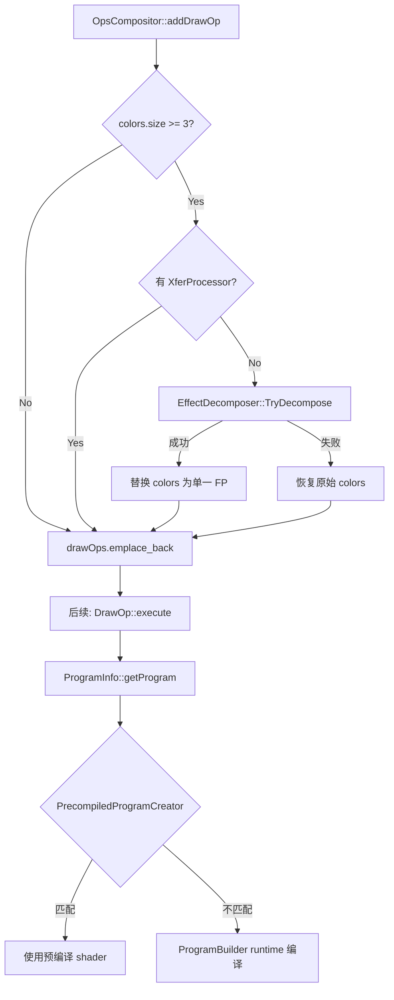

## Product Overview

将已实现但未接入调用链的 EffectDecomposer 集成到渲染流程中，作为多 FP（3+ fragment processors）链的兜底分解方案，使得复杂效果链能够通过多 pass 渲染被预编译 shader 系统覆盖，避免 fallback 到运行时 GLSL 拼接。

## Core Features

- 在 OpsCompositor::addDrawOp() 中，当 DrawOp 的 color FP 数量 >= 3 时，调用 EffectDecomposer::TryDecompose 将其分解为多 pass
- 分解成功后用单一替代 FP 替换原始 colors 链，使后续 PrecompiledProgramCreator 能匹配预编译 shader
- 分解失败时安全 fallback，不影响现有 ProgramBuilder 运行时编译路径
- 添加测试用例验证 3-FP 链分解功能正确性

## Tech Stack

- Language: C++17
- Build System: CMake + Ninja
- Test Framework: Google Test
- 现有架构：OpsCompositor → DrawOp → ProgramInfo → PrecompiledProgramCreator/ProgramBuilder

## Implementation Approach

**策略**：在 `OpsCompositor::addDrawOp()` 内部，所有 color FP 添加完毕后、`drawOps.emplace_back(op)` 之前，检测 `colors.size() >= 3` 时调用 `EffectDecomposer::TryDecompose()`。

**关键技术决策**：

1. **触发阈值 >= 3**（而非 >= 2）：2-FP 链已有专门的预编译 shader 覆盖（TextureColorMatrixShader、TextureClipShader），不需要 decompose
2. **排除有 XferProcessor 的情况**：有 PorterDuffXferProcessor 时，decompose 后的单 FP 仍无法匹配预编译 shader（XP 检查会失败），decompose 无意义
3. **访问 DrawOp::colors**：colors 是 protected 成员，通过添加 `numColorProcessors()` 和 `decomposeColorProcessors()` 公开方法暴露，比 friend class 更安全
4. **allocator 选择**：使用 `drawingAllocator()`（即 DrawingBuffer 级别的 BlockAllocator），确保新 FP 与 DrawOp 同生命周期

**性能与安全性**：

- TryDecompose 返回 nullptr 时不影响原有路径（零开销 fallback）
- 中间 RT 通过 BackingFit::Approx + ResourceCache 复用，不会每帧重新分配
- 已有先例：makeClipTexture() 在同一位置用相同模式创建中间渲染任务
- fillRTWithFP 创建的 OpsRenderTask 在 renderTasks 中排在最终 task 之前，纹理依赖顺序天然正确

## Implementation Notes

- `DrawOp::colors` 当前是 protected，OpsCompositor 中只能通过公开方法 `addColorFP()` 修改。需要新增方法让 OpsCompositor 能访问 colors 向量进行 decompose 操作
- EffectDecomposer 的 processors 参数是 `vector&` 引用，会 move-from 内部元素。成功时返回替代 FP，失败时 processors 内容处于 moved-from 状态，需要在调用前保存必要信息或在失败时有恢复策略
- 由于 move-from 问题，实际做法应该是：先检查 colors.size() >= 3，若是则直接把整个 colors 向量传给 TryDecompose，成功后 clear + emplace_back 新 FP。失败时由于 FP 已被 move，DrawOp 无法正常使用，此时应直接 return（放弃绘制），让调用者 fallback 到不 decompose 的路径
- 更安全的做法：EffectDecomposer 失败时保证 processors 不被修改（先 clone 或者 TryDecompose 内部在失败时恢复），但从当前实现看失败会 return nullptr 且 processors 已被部分 move，需要修改 EffectDecomposer 或调整调用策略
- 实际上看 EffectDecomposer 代码：只有 `std::move(processors[i])` 在循环中逐个 move，如果中途失败返回 nullptr 时，前面的 FP 已经被 move 到 fillRTWithFP 中了（已经提交为中间 pass），但后面的还在。这意味着失败时原始 DrawOp 的 colors 已经被破坏。最安全的策略：**不修改 EffectDecomposer，在调用前将 colors move 出来，成功则替换，失败则跳过整个 DrawOp**（这是当前代码的设计意图——失败 = 放弃预编译加速，让 ProgramBuilder 处理）

**实际策略修正**：由于 TryDecompose 失败时 colors 已被破坏，不能简单 fallback。正确做法是：

- 成功：clear colors，emplace_back 替代 FP
- 失败：不调用 TryDecompose。改为先调用 `PrecompiledProgramCreator` 的快速 check（如 PermutationMatcher），只在确定匹配不上时才 decompose

最终策略：**始终 decompose**（colors >= 3 时），因为 3+ FP 链在 PermutationMatcher 中 100% 无法匹配（所有 matcher 都检查 numFP <= 2）。所以 decompose 是唯一出路，失败则跳过绘制或 fallback 到原始路径（让 ProgramBuilder 处理未分解的链）。

**最终决定**：

- colors >= 3 时，先把 colors move 到临时变量
- 调用 TryDecompose
- 成功：用替代 FP 重新填充 colors
- 失败：把临时变量 move 回 colors（恢复原状），让 ProgramBuilder runtime 编译兜底

## Architecture Design



## Directory Structure

```
src/gpu/
├── ops/
│   └── DrawOp.h                  # [MODIFY] 添加 colorProcessors() 访问方法和 setColorProcessors() 替换方法
├── OpsCompositor.cpp             # [MODIFY] 在 addDrawOp() 中插入 EffectDecomposer 调用逻辑
├── EffectDecomposer.h            # [EXISTING] 已实现，无需修改
└── EffectDecomposer.cpp          # [EXISTING] 已实现，无需修改

test/src/
└── ShaderPermutationTest.cpp     # [MODIFY] 添加 EffectDecomposer 集成测试用例
```

## Key Code Structures

```cpp
// DrawOp.h - 新增公开方法
class DrawOp {
 public:
  // 获取 color processors 向量的可变引用，供 OpsCompositor 进行 decompose 操作
  std::vector<PlacementPtr<FragmentProcessor>>& colorProcessors();
  size_t numColorProcessors() const;
};
```