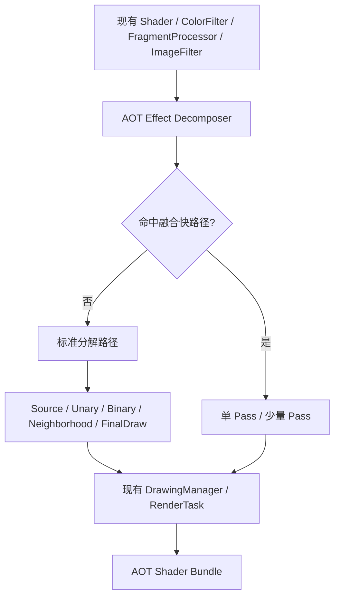

## 用户需求

在 `docs/` 目录下新建一份精简的设计文档 `shader-aot-decomposition.md`，描述我们在对话中收敛的 TGFX AOT 效果分解方案。原有的 `docs/shader-effect-planning-system.md`（1366 行）保留不动。

## 产品概述

该文档是 TGFX Shader 变体系统的新一版设计方案，用最小架构解决三个核心问题：运行时不拼接 Shader、变体数量可控、任意复杂内置效果等效执行。

## 核心内容

- 目标与非目标：明确界定做什么、不做什么
- 基础 Pass 类型定义：Source / Unary / Binary / Neighborhood / FinalDraw
- 递归分解算法及终止性保证
- 结构归纳完备性证明
- 变体加法增长的数学论证
- 坐标、Bounds、Alpha、ColorSpace 契约
- Bundle 闭包验证机制
- 融合快路径（可选性能优化）
- 与现有系统的关系（FPFlattenHelper、ImageFilter、DrawingManager）
- 迁移与测试计划
- 正确性门槛
- 文档约 400-600 行，结构清晰、可操作

## Tech Stack

- 文档格式：Markdown
- 目标路径：`docs/shader-aot-decomposition.md`
- 不涉及代码修改

## Implementation Approach

这是一份纯文档任务。基于对话中已收敛的技术方案，将散落在多轮对话中的设计决策、架构图、证明、示例和迁移计划整合为一份结构化的 Markdown 文档。文档需要准确引用现有代码中的关键组件（FPFlattenHelper、ComposeImageFilter、DrawingManager::fillRTWithFP、ProgramInfo::getProgram 等），确保方案描述与代码现状一致。

## Implementation Notes

- 文档中的代码引用需要与实际代码路径和接口一致（已通过探索验证）
- 现有回退机制在 `ProgramInfo::getProgram()` 中：先尝试 `PrecompiledProgramCreator::CreateProgram`，失败后回退到 `ProgramBuilder::CreateProgram`
- `FPFlattenHelper` 中的 `FlattenToTexture` 和 `EnsureSimpleBlendChild` 是当前局部物化的雏形
- `ComposeImageFilter` 的 Forward/Reverse Bounds 和顺序执行逻辑需要在文档中明确保留
- `DrawingManager::fillRTWithFP()` 是基础 Pass 执行的现有机制

## Architecture Design

文档描述的目标架构：



## Directory Structure

```
docs/
├── shader-aot-decomposition.md          # [NEW] 精简版 AOT 效果分解设计文档，约 400-600 行。包含目标定义、基础 Pass 类型、递归分解算法、完备性证明、变体控制、契约定义、Bundle 闭包、融合快路径、迁移计划和正确性门槛。
└── shader-effect-planning-system.md     # [保留] 原有完整版效果规划系统文档，不修改
```