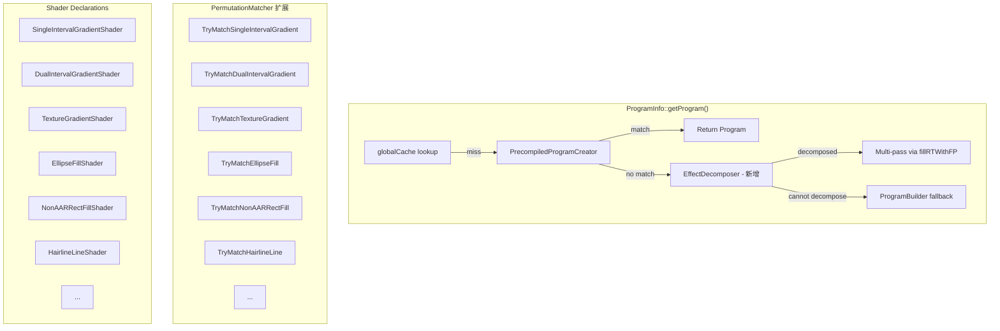

## Product Overview

为 TGFX Shader Permutation 系统完成三项剩余扩展工作，提升预编译 shader 对运行时绘制路径的覆盖率，减少对动态 ProgramBuilder 的依赖。

## Core Features

1. **渐变 Colorizer 补全** — 新增 3 个预编译 Shader（SingleIntervalGradientShader、DualIntervalGradientShader、TextureGradientShader），覆盖 2-stop、3/4-stop 及 16+ stop 渐变场景，搭配 PermutationMatcher 匹配逻辑
2. **GP 级 Shader 声明** — 为 9 个未覆盖的 GeometryProcessor（Ellipse、ComplexEllipse、NonAARRect、ComplexNonAARRect、RoundStrokeRect、ShapeInstanced、Mesh、HairlineLine、HairlineQuad）声明预编译 Shader 并编写对应 GLSL，使其不再依赖运行时 GLSL 拼接
3. **多 Pass 递归分解框架** — 实现 EffectDecomposer，能将包含 ComposeFragmentProcessor 或超出单个预编译 shader 能力的复杂 FP 树自动拆分为多个 sub-pass（中间纹理 + fillRTWithFP），在 OpsCompositor 层面透明完成

## Tech Stack

- 语言：C++17
- GLSL 版本：450
- 构建系统：CMake + Ninja
- 预编译 shader 框架：项目自有 `PrecompiledShader` / `ShaderRegistry` / `TGFX_REGISTER_SHADER` 体系
- 运行时嫁接点：`PrecompiledProgramCreator::CreateProgram()` → `PermutationMatcher::MatchPermutation()`

## Implementation Approach

### 任务 1：渐变 Colorizer 补全

**策略**：为 3 种 Colorizer 各自创建独立的 PrecompiledShader 子类，复用 gradient_fill.vert（layout 计算一致），编写独立的 fragment shader。在 PermutationMatcher 中新增 3 个 TryMatch 函数。

**关键决策**：

- SingleInterval 和 DualInterval 的 colorize 逻辑极为简单（前者 `mix(start, end, t)`，后者两段分段线性），不需要额外排列维度，仅保留 LAYOUT_TYPE(4) 一个维度
- TextureGradient 需要纹理采样器，维度同样只有 LAYOUT_TYPE(4)
- 三者共享 gradient_fill.vert（所有梯度 layout 的顶点变换相同）
- PermutationMatcher 的匹配条件与现有 `TryMatchGradientFill` 类似，仅 colorizer name 不同

### 任务 2：GP 级 Shader 声明

**策略**：为每种 GP 创建「GP专用 Shader」，每个 Shader 包含独立的 vertex shader（编码该 GP 的顶点变换、属性布局和 coverage 计算），fragment shader 通常很简单（color * coverage 输出或纯色输出）。

**关键决策**：

- 大多数 GP（Ellipse、NonAARRect、RoundStrokeRect 等）的 fragment shader 几乎相同（基于 coverage 计算 alpha），差异在 vertex shader
- GP 的排列维度来自其 `onComputeProcessorKey` 中的 flags（如 `stroke` / `commonColor` / `aaType`）
- 分批推进：先做最简单的（HairlineLine/HairlineQuad 只有 1 bit 变体），再做复杂的
- PermutationMatcher 中通过 GP name 前缀路由到对应的 TryMatch 函数

### 任务 3：多 Pass 递归分解框架

**策略**：在 `PrecompiledProgramCreator::CreateProgram()` 失败（返回 nullptr）后、回退到 ProgramBuilder 之前，插入一个 EffectDecomposer 尝试将 ProgramInfo 中的 FP 树拆解为可分别匹配预编译 shader 的多个子 pass。

**关键决策**：

- 参考 GaussianBlurImageFilter 已有模式：中间 pass 通过 `DrawingManager::fillRTWithFP()` 渲染到临时 RenderTargetProxy，最终 pass 将临时纹理作为输入
- 拆解入口放在 `ProgramInfo::getProgram()` 内部（在 PrecompiledProgramCreator 和 ProgramBuilder 之间），而非 OpsCompositor 层面，这样避免大规模改动 addDrawOp 流程
- 初始仅处理 `numFragmentProcessors() > 1` 且含 ComposeFragmentProcessor / 多层嵌套 XfermodeFragmentProcessor 的情况
- 拆解产出的中间 pass 不改变原 DrawOp 的 GP/顶点数据，只替换 FP 部分

## Implementation Notes

- **顶点 shader 复用**：3 个新渐变 shader 可共用 gradient_fill.vert（文件引用相同路径），减少代码膨胀
- **GP shader 的 uniform 一致性**：GP 的 viewMatrix/projectionMatrix 通过标准 VertexUniformBlock 传递，与 DefaultGeometryProcessor 保持相同 layout binding
- **多 Pass 框架的降级安全**：EffectDecomposer 返回空表示无法拆解，继续 fallback 到 ProgramBuilder，保证不引入回归
- **编译期变体控制**：SingleInterval/DualInterval 各 4 变体，TextureGradient 4 变体，GP shader 每个 2-4 变体，总增量约 50-70 个变体

## Architecture Design



## Directory Structure

```
src/gpu/shaders/level1/
├── SingleIntervalGradientShader.h   # [NEW] 2-stop 渐变 shader 声明。维度 LAYOUT_TYPE(4)，4 变体。使用 SingleIntervalGradientColorizer 的 start/end uniform，复用 gradient_fill.vert。
├── DualIntervalGradientShader.h     # [NEW] 3/4-stop 渐变 shader 声明。维度 LAYOUT_TYPE(4)，4 变体。使用 DualIntervalGradientColorizer 的 scale/bias/threshold uniform。
├── TextureGradientShader.h          # [NEW] 16+ stop 渐变 shader 声明。维度 LAYOUT_TYPE(4)，4 变体。需要纹理采样器获取颜色。
├── EllipseFillShader.h              # [NEW] 椭圆 GP shader 声明。维度 STROKE(bool) × HAS_COLOR(bool) = 4 变体。
├── NonAARRectFillShader.h           # [NEW] 非AA圆角矩形 GP shader。维度 STROKE(bool) × HAS_COLOR(bool) = 4 变体。
├── ComplexEllipseFillShader.h       # [NEW] 复杂椭圆 GP shader（内外椭圆）。维度同 Ellipse。
├── ComplexNonAARRectFillShader.h    # [NEW] 复杂非AA矩形 GP shader。
├── RoundStrokeRectFillShader.h      # [NEW] 圆角描边矩形 GP shader。
├── ShapeInstancedFillShader.h       # [NEW] 实例化形状 GP shader。维度 HAS_COLORS(bool) × AA(bool) = 4 变体。
├── MeshFillShader.h                 # [NEW] Mesh GP shader。
├── HairlineLineShader.h             # [NEW] 细线 GP shader。维度 AA(bool) = 2 变体。
└── HairlineQuadShader.h             # [NEW] 曲线细线 GP shader。维度 AA(bool) = 2 变体。

src/gpu/shaders/glsl/level1/
├── single_interval_gradient.frag    # [NEW] SingleInterval colorizer fragment shader。mix(start, end, t) 实现。
├── dual_interval_gradient.frag      # [NEW] DualInterval colorizer fragment shader。分段线性 scale*t+bias 实现。
├── texture_gradient.frag            # [NEW] TextureGradient colorizer fragment shader。texture(sampler, vec2(t, 0.5)) 实现。
├── ellipse_fill.vert                # [NEW] EllipseGP vertex shader。变换 + ellipse offset/radii 传递。
├── ellipse_fill.frag                # [NEW] EllipseGP fragment shader。基于 distance 的 coverage 计算。
├── non_aa_rrect_fill.vert           # [NEW] NonAARRectGP vertex shader。
├── non_aa_rrect_fill.frag           # [NEW] NonAARRectGP fragment shader。基于 SDF 的 coverage。
├── complex_ellipse_fill.vert        # [NEW] 复杂椭圆 vertex shader。
├── complex_ellipse_fill.frag        # [NEW] 复杂椭圆 fragment shader。
├── complex_non_aa_rrect_fill.vert   # [NEW]
├── complex_non_aa_rrect_fill.frag   # [NEW]
├── round_stroke_rect_fill.vert      # [NEW]
├── round_stroke_rect_fill.frag      # [NEW]
├── shape_instanced_fill.vert        # [NEW] ShapeInstancedGP vertex shader（使用 instance attributes）。
├── shape_instanced_fill.frag        # [NEW]
├── mesh_fill.vert                   # [NEW] MeshGP vertex shader。
├── mesh_fill.frag                   # [NEW]
├── hairline_line.vert               # [NEW] HairlineLineGP vertex shader。
├── hairline_line.frag               # [NEW] 基于 edgeDistance 的 coverage。
├── hairline_quad.vert               # [NEW] HairlineQuadGP vertex shader。
└── hairline_quad.frag               # [NEW]

src/gpu/
├── PermutationMatcher.cpp           # [MODIFY] 添加 TryMatchSingleIntervalGradient / TryMatchDualIntervalGradient / TryMatchTextureGradient + 9 个 GP 匹配函数
├── PermutationMatcher.h             # [MODIFY] 无需改动（MatchPermutation 已是入口）
├── EffectDecomposer.h               # [NEW] 多 Pass 分解器接口。接受 ProgramInfo，返回可选的分解方案（中间 FP + 目标 RT 描述）
├── EffectDecomposer.cpp             # [NEW] 分解逻辑实现：识别 ComposeFragmentProcessor 嵌套、多 color FP 串联等模式
└── ProgramInfo.cpp                  # [MODIFY] 在 getProgram() 中 PrecompiledProgramCreator 失败后、ProgramBuilder 前插入 EffectDecomposer 调用
```