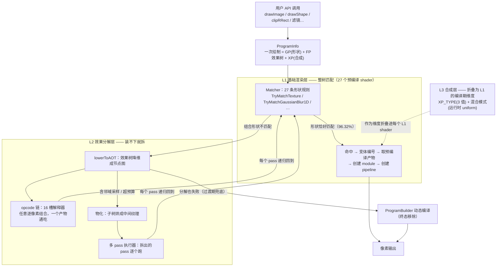
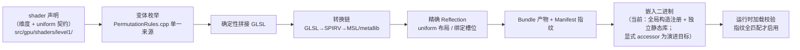
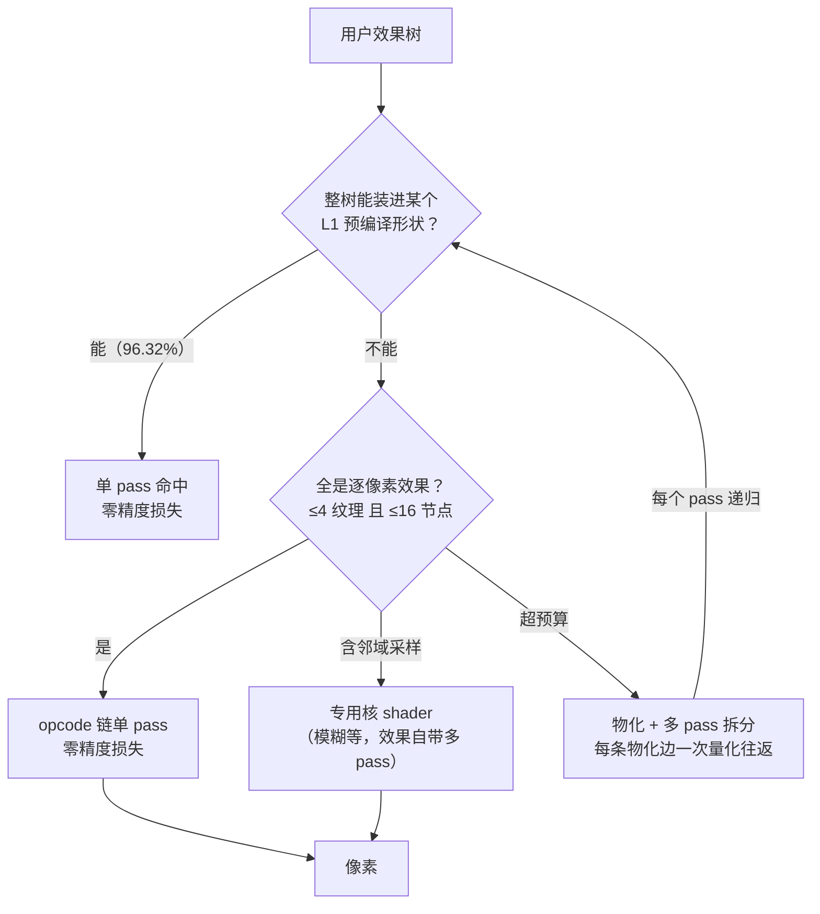
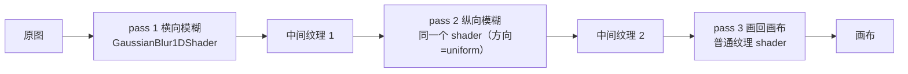
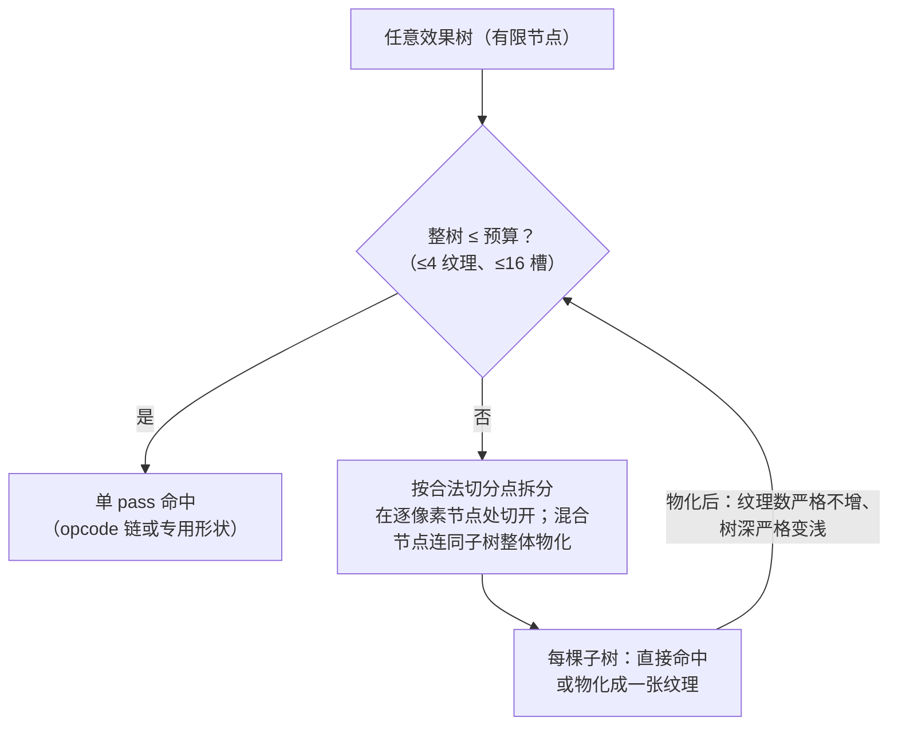

# TGFX Shader AOT 架构详解（L1 / L2 / L3）

> 由浅入深版。第一部分（§1–§3）不需要渲染管线背景；第二部分（§4–§6）逐层拆解三层体系；第三部分（§7–§9）讲终态保证与实施计划。数据基线：2026-09 全量 Metal 测试（686 个用例）。
>
> 本文档补全 `docs/README.md` 中对本文件的引用。**文中所有规则性结论以当前代码为准**；引用其他文档处均经代码级校验，已知出入在 §5.7 显式标注。`docs/research/shader-precompile-master-plan.md` 中的 L1/L2/L3（level2/level3 目录、359 个 shader）是早期研究规划，实际实现走的是 kernel 分解 + XP 折叠路线，本文描述的是实际实现。

---

## 第一部分：问题与核心思想

### 1. main 分支是怎么渲染的

GPU 渲染的每一步都要执行一段叫 **shader** 的小程序（告诉 GPU"这个像素该是什么颜色"）。shader 必须先编译成 GPU 能执行的格式才能运行。

**main 分支的方式：现场写、现场编译。**

核心组件是 `ProgramBuilder`（程序构建器）。每次绘制遇到一种新的效果组合时，它做三件事：

1. 把这次绘制用到的所有效果（纹理、滤镜、混合模式、裁剪……）**拼接**成一段 shader 源代码；
2. 现场编译这段代码；
3. 编译结果缓存起来，下次同样的组合直接复用。

举例：用户画一张带模糊阴影的图片，main 会把「采样图片 → 模糊 → 染色成阴影色 → 混合到画布」整条链拼进**一个** shader 里。

**这个方式的优点**：表达能力无限。用户无论怎么叠加效果（图片上加滤镜再叠混合模式再裁剪……），都能拼出正确的 shader。

**缺点**：第一次遇到某种组合时必须现场编译。GPU shader 编译是毫秒到百毫秒级的操作，表现为**首帧卡顿**——动画第一帧掉帧、页面切换闪顿，都来自这里。组合是无限的（用户可以任意叠加），所以不可能靠"多缓存"解决，必须从源头消除现场编译。

三个贯穿全文的术语（记住它们，后面所有内容都围绕这三样东西）：

| 术语 | 全称 | 通俗解释 |
|---|---|---|
| **GP** | GeometryProcessor | 几何处理器：这次画的是什么形状（矩形、椭圆、文字……），顶点数据怎么给 |
| **FP** | FragmentProcessor | 效果处理器：像素颜色怎么算（采样纹理、颜色矩阵、模糊、混合……）。用户叠加的每个效果都是一个 FP，它们组成一棵树 |
| **XP** | XferProcessor | 合成处理器：算好的颜色怎么和画布上已有的颜色合成（普通覆盖、透明叠加、Multiply、ColorDodge……） |

一次绘制 = GP（形状）+ 一棵 FP 树（效果）+ XP（合成方式）。main 的 ProgramBuilder 把这三样全部现场拼接编译。

### 2. 问题：能不能把 shader 提前编译好

AOT（Ahead-Of-Time，预先编译）的目标：**把所有 shader 在构建期编译好，打包进库，运行时直接取用，零现场编译。**

核心矛盾在于：

```
效果组合是无限的（用户任意叠加）
        vs
预编译产物必须是有限的（包体积、构建时间）
```

这个矛盾真的无解吗？实测数据给出了乐观答案。当前分支全量 Metal 测试（686 个用例）：

- 一共发生了 1,986 次冷 Program 创建（统计按测试隔离累计，同一组合在不同测试中会重复计入；真实唯一结构远少于此）；
- 其中 1,912 次（96.32%）命中了预编译产物；
- 只有 74 次没命中。

也就是说：**组合虽然无限，但真实世界出现的组合高度收敛，而且收敛到的结构可以归类为有限几种"形状"**。只要把这有限几种形状做成预编译产物，再用"组装规则"覆盖组合的长尾，零现场编译就是可行的。这正是 L1/L2/L3 三层体系要做的事。

### 3. 核心思想：预制件体系

一个类比：装修房子。

- **动态编译（main）**＝全屋现场打家具。什么户型都能做，但开工慢。
- **AOT 三层体系**＝工厂预制件体系：

| 层 | 类比 | 真实含义 |
|---|---|---|
| **L1 基础渲染层** | 整装的房间模块（整体卫浴、整体厨房） | 最常见的完整效果组合，每个组合一个预编译 shader，拿来就用 |
| **L2 效果分解层** | 标准板材 + 组装说明书 | 少见的组合现场"拼装"——但拼装用的每一块板材都是预制的，拼装本身不需要焊接（编译） |
| **L3 合成层** | 可替换的五金连接件 | 混合模式这类"配件"，作为运行时参数挂在 L1 的产物上，不为每种模式单独编译 |

整个体系有一条**最重要的设计原则**，理解了它就理解了一半：

> **编译期只区分"接口不同"的东西；所有"数值不同"的东西都是运行时参数。**

举例：模糊的半径是 3 还是 30？——数值不同，做成运行时 uniform（shader 里的可变参数），**一个预编译 shader 通吃**。采样的纹理有几个？——接口不同（绑定槽位数量不同），必须是编译期维度，分开编译几个变体。

这条原则是"变体不爆炸"的秘密。反例警示：如果模糊半径做成编译期维度，10 档半径 × 其他 3 个维度 = 变体数翻 10 倍，包体积和构建时间失控。历史上 GaussianBlur1DShader 就犯过这个错并已修正——现在半径是 uniform，整个 shader 只剩 1 个维度（合成方式），共 3 个变体。

### 3.1 全景架构图：一次绘制经过什么



读图要点：L2 拆出的**每个 pass 仍然回到 L1 匹配**——L2 不是独立的渲染路径，而是"把装不下的树拆成 L1 装得下的片段"的组织者。L3 没有自己的 pass，它作为维度折叠进所有 L1 产物。

### 3.2 构建期产线：预编译产物从哪来



构建期与运行时共用同一份声明（同一个变体编码、同一个 uniform 契约）——这是"产物必然对得上运行时请求"的根基，也是 `AOTClosureVerifier` 能机器化验证完整性的前提。注意当前嵌入机制仍是全局静态构造注册（`BundleToCpp.cmake` 生成 `Registrar` 对象，独立静态库 `tgfx_embedded_bundles` 供 `-force_load`），切换到显式 accessor 是主计划的待办项，不要当成现状。

---

## 第二部分：三层体系逐层拆解

### 4. L1 基础渲染层：整树匹配

#### 4.1 是什么

L1 是一组**预编译 shader**（当前注册 27 个声明，位于 `src/gpu/shaders/level1/`；全量实测命中过其中 25 种）加上一套**匹配规则**（`PermutationMatcher.cpp` 的 27 条 `TryMatch`，固定顺序）。每次绘制时，matcher 检查这次的「GP + FP 树 + XP」是否恰好是某个预编译 shader 所声明的形状，是则直接命中。

一个 shader 声明的例子（`GaussianBlur1DShader.h`）：

```cpp
// 维度：只有 HAS_XP（合成方式，3 种取值）→ 共 3 个变体
// 运行时 uniform：Kernel（权重表）、Radius（半径）、Step（方向）、Subset（子区）
// —— 半径、方向、权重全部运行时传，不占变体
class GaussianBlur1DShader : public PrecompiledShader { ... };
```

匹配逻辑：matcher 按固定顺序遍历 27 条 `TryMatchXxx` 规则，每条规则检查一种形状（GP 类型、FP 树结构、coverage 形态、合成方式），命中则返回 shader 名 + 变体编号，随后查找预编译产物 → 创建 shader module → 创建 pipeline → 渲染。

#### 4.2 三个维度轴

L1 的覆盖面 = 三个轴的笛卡尔积，逐轴看闭合状态：

**GP 轴（12 种，已闭合）**：矩形、椭圆、圆角矩形、文字图集、网格、发丝线……每种 GP 都有对应的预编译 vertex shader。

**colorFP 轴（效果侧，按"数学结构"分四族）**：

| 族 | 数学结构 | 代表成员 | 骨架机制 |
|---|---|---|---|
| 纹理/渐变 | 直接采样 | 图片绘制、线性/径向/锥形渐变、YUV | 每种一个 shader，tile mode / 子区等全 uniform |
| 程序化源 | 按坐标算颜色，无输入纹理 | Perlin 噪声 | `PerlinNoiseFillShader`：噪声源 + 1 个后置效果融合，效果种类是 uniform |
| 邻域采样（可分离核） | 采样周围一圈像素加权平均 | 高斯模糊、Glass 帐篷模糊 | 固定最大循环次数 + 运行时早退；权重表 CPU 算好上传 |
| 程序化坐标采样 | 按计算出的偏移量采样背景 | 玻璃折射（SDF/UDF）、未来的位移贴图 | 背景纹理 + 偏移场（可程序计算或查纹理）+ 合成参数 |

**coverageFP 轴（裁剪侧）**：裁剪在本项目里叫 coverage（覆盖率）。画一个形状时，形状边缘的像素可能只有 50% 在裁剪范围内，coverage 告诉 shader 这个像素只画 50%。已闭合的形态：

| 形态 | 场景 | 机制 |
|---|---|---|
| AARect 抗锯齿矩形裁剪 | clipRect（需 AA 的场景；轴对齐无 AA 的 clipRect 由 GPU scissor 承担，不进 shader） | 运行时裁剪契约：`Rect + HasClip` uniform，值运行时上传、不产生新变体。持有方：11 个 L1 shader（5 个经 `coverage_uniforms.inc`、6 个直接声明）；opcode 链另有 `OP_AARECT_COVERAGE` 槽承担 |
| LocalMask 本地遮罩 | 阴影/内阴影的 mask | 额外一个纹理采样乘上去（当前仅 `QuadTextureFillShader` 持有该维度） |
| DeviceMask 设备空间遮罩 | 复杂路径裁剪（先栅格化成遮罩图） | 同上但坐标是设备空间（`TextureFill`/`EllipseFill`/`QuadTextureFill` 持有） |
| **RRect 圆角矩形裁剪** | clipRRect——**当前缺口（32 次未命中）** | **WP3 待实现**：扩展现有运行时裁剪契约，加参数不加变体 |

#### 4.3 现状与缺口

全量数据：L1 命中 1,912 次（96.32%）。命中大户：图片绘制 569 次、效果链 292 次、纯色 229 次、文字 152 次、模糊 136 次、遮罩 106 次……

未命中 73 次的构成（都已在计划内；与 `decompositionAudit` 的 32+33+8 双重闭合）：

| 缺口 | 次数 | 归属 |
|---|---|---|
| RRect 裁剪（含 `Compose(DSTE, RRect×N)` 多重裁剪场景的 RRect blocker） | 32 | WP3 |
| Glass 折射（屏上） | 21 | WP2 |
| Glass 帐篷模糊（屏上 program 查找形态；另有离屏 fill 98 次动态编译） | 12 | WP1 |
| RectEffect 边角形态 | 8 | WP3（判定后可能只需放宽准入） |

### 5. L2 效果分解层：装不下就拆

#### 5.1 为什么需要 L2

L1 的每个 shader 只认一种固定形状。用户叠了 4 个滤镜？树的结构变了，L1 大概率没有现成形状。两种出路：

1. 为每种叠加组合预制 shader——组合爆炸，不可行；
2. **发明一个"万能形状"**，让任意（逐像素）效果组合都能塞进去——这就是 L2 的第一件武器。

L2 的整体决策流程（三件武器如何配合）：



#### 5.2 武器一：opcode 链——一个 shader 顶任意组合

`PointwiseChainShader`（效果链 shader）的核心思想：**不做每种组合的专用 shader，做一个"解释器"shader**。

类比：洗衣机。机器（shader）是预制的，洗衣程序（效果组合）是运行时设置的——你不需要为"衬衣+轻柔+脱水"和"牛仔裤+强力+烘干"各买一台洗衣机。

具体机制：

- shader 里预置 16 个"槽位"，每个槽位可以放一个操作（颜色矩阵 / 亮度 / 阈值 / 色彩空间转换 / 常量色 / 混合），操作种类和参数都是运行时 uniform；
- 纹理输入预编译两档：0 张和 4 张——1~3 张纹理的组合骑 4 张档的产物，缺的槽位绑 1×1 白色占位纹理（OpenGL 的 wrap/filter 是 texture-object 状态，同一张物理纹理不能既当 repeat 叶又当 clamp 占位叶）；
- 运行时把用户的 FP 树**降维（lowerToAOT）成一张节点图**，节点图映射到槽位数组上传，shader 按图执行。

于是「图片 + 颜色矩阵 + 与另一张图 Multiply + 常量色混合」这种任意组合，都命中**同一个**预编译产物。实测它命中 292 次，是消灭组合爆炸的最大功臣。

#### 5.3 武器二：物化——把子树烘成一张图

opcode 链只装得下**逐像素**效果（同坐标、一进一出）。装不下的情况：

- **模糊类**（邻域采样）：输出像素依赖周围一圈输入像素；
- **纹理太多**（超过 4 张）或**链太深**（超过 16 槽）。

这时用**物化（FlattenToTexture）**：把整棵子树先画到一张离屏纹理上，画完之后这张纹理就成了一张普通的图，再作为一个纹理叶参与后续——后续部分就能装进 opcode 链了。

```
原始树：  Blend( Matrix(TextureA), Blur(TextureB) )     ← Blur 装不进链
物化后：  Blend( Matrix(TextureA), TextureBlur )          ← TextureBlur 是一张已画好的图，能装进链
         （物化 pass：离屏画 Blur(TextureB) → 纹理，此 pass 本身命中模糊专用 shader）
```

实测全量测试发生 1,154 次物化，全部由预编译 kernel 完成（零现场编译）。每次物化的代价：一次离屏渲染 + 一次中间纹理读写（约几 MB 带宽），以及一次 8bit 量化往返（见 §5.5）。

#### 5.4 武器三：多 pass 计划

更复杂的树需要拆成多个 pass 依次执行，前一个 pass 的输出纹理作为后一个 pass 的输入。`AOTPlanExecutor`（计划执行器）负责调度：它把 pass 图变成一组渲染任务，逐 pass 物化，最后一个 pass 画到真正的画布上。

最典型的多 pass 例子——二维高斯模糊（**这个例子说明"多 pass"不是 AOT 的额外负担，main 上它本来就是两 pass**）：

```
pass 1: 横向模糊  → 中间纹理     （命中 GaussianBlur1DShader 变体 A）
pass 2: 纵向模糊  → 中间纹理     （命中同一个 shader，方向是 uniform）
pass 3: 结果画回画布             （命中普通纹理绘制 shader）
```



三个 pass 命中的是**两个**预编译产物（pass 1/2 共用一个，方向靠 uniform 区分）——这正是"数值不同不占变体"原则的直接收益。

当前已实现的多 pass 形态：线性尾链（`PointwiseTail`）、噪声链（Perlin + 尾链）——机制存在，但全量实测 `multiPassPlans=0`（所有可分解的组合都装进了单 pass，多 pass 路径尚未被真实场景触发过，这也是 WP4 必须测试夹具先行的原因）。**待实现（WP4）**：DAG 切分——当效果树又深纹理又多时，自动找合法切分点拆成多个链 pass。可解性已证明：任何效果树都能拆成每 pass ≤4 纹理的序列（装不下就物化，物化后纹理数必然减少，递归必然到底）。

#### 5.5 精度专节：哪里无损，哪里有损

三种情况，分开记：

| 路径 | 精度 | 原因 |
|---|---|---|
| 单 pass 命中（含 opcode 链） | **实测差分 ≤1/255，多数场景逐字节一致** | 整条链在 shader 内用浮点算完，没有中间落盘；opcode 链与 JIT 拼接的浮点求值顺序可能有末位差异，一致性由差分测试背书而非构造保证 |
| 效果自带的多 pass（模糊两方向等） | **实测差分 ≤1/255** | main 上同样是多 pass、同样用 8bit 中间纹理，拆分点一模一样；离线编译与运行时编译的产物数值可能有末位差异 |
| **物化边 / 多 pass 拆分** | **一次 8bit 量化往返**（每通道 ≤0.5/255） | main 上这部分子树是在同一个 shader 里用浮点算的，我们把它落了一次盘 |

第三种是本体系相对 main 的**唯一系统性精度差异**。它对绝大多数内容不可见（差分测试以"每个像素每通道差 ≤1"为标准全部通过），敏感场景是半透明边缘的多次 alpha 乘积和暗部色彩转换。防护措施：嵌套绘制禁止叠加自己的量化往返（只放行单 pass 计划）、每次接入新效果族必须做双路径像素差分。

### 5.6 实例集：main 的"单 shader 拼接"逐例怎么拆

以下 6 组都是真实存在的组合（前 4 组有实测命中数据，第 5 组是当前缺口，第 6 组是构造场景）。每组三行：用户怎么写 → main 在一个 shader 里拼了什么 → 我们拆成什么。**注意：pass 划分基于匹配规则与物化决策代码的机制推导（有命中/物化统计数据佐证），不是逐 pass 运行时 trace 的实录**——实施 WP1–WP4 时如遇出入以实际 trace 为准。

#### 例 1：图片 + 饱和度滤镜 + 矩形裁剪（最常见，单 pass 直接收下）

```cpp
paint.setShader(ImageShader::Make(image));
paint.setColorFilter(ColorFilter::Matrix(saturationMatrix));
canvas->drawRect(bounds, paint);   // 处在一个 clipRect 内
```

main 单 shader（全部内联）：

```glsl
color = texture(u_image, v_uv);
color = saturateMatrix * color;          // 颜色矩阵
color *= aaRectCoverage(u_clip);         // 解析裁剪
```

我们的分解：**不拆，单 pass**。分两种情形：

- 不带裁剪时：matcher 识别 Compose(TextureEffect, ColorMatrix) 形状 → `TexturedEffectShader` 整树命中（滤镜种类是 OpType uniform）；
- 带 AA 矩形裁剪时：RectEffect 由 `lowerToAOT` 折叠成 opcode 链的 AARect coverage 槽（`OP_AARECT_COVERAGE`），整体进 `PointwiseChainShader` 单 pass——`TexturedEffectShader` 自身不挂 coverage FP，不参与此形态（`AOTRenderConsistencyTest.cpp:1101` 有注释佐证）。

两条路径都单 pass、零精度差异。注意轴对齐无 AA 的 clipRect 由 GPU scissor 直接承担，不进入 shader 层。

#### 例 2：两图 Multiply 混合 + 亮度滤镜（opcode 链的教科书场景）

```cpp
auto shader = BlendShader::Make(imageShaderA, imageShaderB, BlendMode::Multiply);
paint.setShader(shader);
paint.setColorFilter(LumaColorFilter::Make());
```

main 单 shader：两张图各采样一次、`xpBlendColors(Multiply)` 和 Luma 系数全部内联。

我们的分解：**不拆，单 pass 进 opcode 链**。lowerToAOT 降维成节点图：图A→叶0、图B→叶1、Multiply→Blend 槽、Luma→Luma 槽 → `PointwiseChainShader`。两个真实纹理叶骑四叶产物（另两个槽位绑 1×1 白色占位），槽位内容和顺序都是运行时 uniform。零精度差异（`AOTL2AuditTest` 对这类单 pass 融合的验收是逐通道 ≤1/255 且零结构差异；`ChainAlphaOnlyChildrenMatchPlainPath` 用例的要求更严：逐字节一致，阈值 0）。

#### 例 3：内阴影（这里开始出现物化）

```cpp
paint.setImageFilter(InnerShadowImageFilter::Make(dx, dy, blurSigma, shadowColor));
canvas->drawImage(image, x, y);
```

main 的终端 draw 是单 shader：模糊阴影的染色、与原图的 SrcATop、原图采样全部内联（模糊本身 main 也离屏做）。

我们的分解（4 个 pass）：

```
pass 1-2  模糊 H/V 两方向      → GaussianBlur1DShader（与 main 同构，main 本来就离屏）
pass 3    物化 dst 侧原图子树   → 离屏纹理（1 次量化往返 ← 唯一的额外代价）
pass 4    终端 chain：two(阴影纹理, 物化图, SrcATop) → PointwiseChainShader（2 叶 + Blend 槽）
```

与 main 的差异：终端那个单 shader 被拆成「1 条物化边 + 1 个 chain pass」，多 1 个离屏 pass、1 次量化。物化不是拍脑袋选的——`AOTMaterializationPolicy` 判定 blend 的 dst 侧子树物化后语义安全（apron 1px、Exact-fit 纹理）才放行。

#### 例 4：背景模糊 / 毛玻璃（效果自带多 pass，结构完全同构）

```cpp
layer->setStyle(LayerStyle::BackgroundBlur(blurRadius));
```

main：背景快照 → 模糊离屏两 pass → 终端单 shader（采样模糊背景 + 内容当 mask）。

我们的分解（3 个 pass，**与 main 一一对应，零额外代价**）：

```
pass 1-2  模糊 H/V            → GaussianBlur1DShader（方向是 uniform，两 pass 共用 1 个变体）
pass 3    终端绘制             → ColorFP=模糊背景纹理 + CoverageFP=内容 mask（LocalMask 形态）
                                 → 命中 QuadTextureFillShader（HAS_LOCAL_MASK 维度当前仅它持有）
```

注意：很多人以为"背景模糊"要特殊处理，其实它的 pass 结构 main 和我们完全一样——main 的模糊也必须离屏。全量数据中同构部分的实绩：模糊两方向 pass 由 `GaussianBlur1DShader` 命中 136 次；例 4 终端 pass 的 LocalMask 形态是 `QuadTextureFillShader` 的对应变体（与 `MaskFillShader` 的 106 次不是同一机制——后者承担形状遮罩离屏纹理的绘制 pass）。

#### 例 5：Glass 玻璃（当前缺口，WP1/WP2 落地后的样子）

```cpp
layer->setStyle(GlassStyle::Make(params));
```

main（当前分支的动态路径）：帐篷模糊离屏 H/V 两 pass（fine/coarse 双尺度）+ 终端单 shader（SDF/UDF 算折射偏移 → 偏移采样背景 + 高光）。

我们的分解（WP1/WP2 后，**pass 数不变，只是全部换成预编译命中**）：

```
pass 1-2  帐篷模糊 H/V（每 pass 单源单半径，
          field 决定读哪个半径分量）        → 邻域核族 shader（权重表/方向/半径全 uniform）
pass 3    终端折射                   → 程序化坐标采样族 shader
                                          （GEOMETRY_KIND=SDF/UDF 编译期维度，
                                           折射强度/高光参数 uniform）
```

这个例子说明关键一点：**"单 shader"的 refraction 部分我们也不拆**——它是逐像素可表达的，做成族成员单 pass 命中；只有帐篷模糊天生多 pass。当前这 3 个 pass 全部走动态编译（全量测试 98 次离屏 fill + 33 次屏上未命中——折射 21 + 帐篷模糊 12——的来源），是 WP1/WP2 的全部目标。

#### 例 6：超预算深组合（当前回退，WP4 后的拆法）

构造场景：5 个纹理叶的混合树，例如 `Blend( Blend( Blend(A,B,Multiply), Blend(C,D,Screen) ), E, Plus )`。

main：单 shader，5 个纹理绑定，全部内联。

当前我们：opcode 链上限 4 个纹理叶 → 降维失败 → 回退 ProgramBuilder（效果正确，只是拿不到预编译收益）。全量测试中此类场景 0 次出现。

WP4 后（DAG 切分）：

```
pass 1  物化 Blend(C,D,Screen) 子树 → 中间纹理 T（1 次量化往返）
pass 2  终端 chain：Blend( Blend(Blend(A,B), T), E ) → A、B、T、E 恰好 4 叶，PointwiseChainShader
```

任何超预算树都能这样拆（§7 的闭环保证），代价是每条物化边一次 RT 往返——这就是"极端组合性能记账"的具体形态：main 单 pass 读完 5 张图，我们 2 个 pass、多一次中间纹理读写。

#### 小结：什么时候拆、拆在哪

| 情况 | 拆不拆 | 额外代价 |
|---|---|---|
| 整树是已声明的形状（例 1） | 不拆 | 无 |
| 纯逐像素组合 ≤4 纹理（例 2） | 不拆（进链） | 无 |
| 含邻域采样（例 3 模糊、例 4、例 5） | 按效果语义拆（main 也这么拆） | 无（与 main 同构） |
| 混合的某侧子树接口不合链（例 3 的 dst 侧） | 物化那棵子树 | 1 次量化/边 |
| 超 4 纹理 / 16 槽（例 6） | DAG 切分 | 每切一刀 1 次量化 + 1 次 RT 往返 |

### 5.7 判定规则总表

上一节的每个"拆不拆"背后都是明确的判定点。完整判定链共 8 个，每个都有代码级定义和结构化失败出口：

| # | 判定点 | 判什么 | 规则位置 | 失败出口（可观测） |
|---|---|---|---|---|
| D1 | L1 整树匹配 | GP+FP树+coverage+XP 是否等于某声明形状 | `PermutationMatcher.cpp` 的 27 条 `TryMatch`，固定顺序 | `NoMatchingRule` + 结构签名 |
| D2 | 分解路由准入 | 是否尝试分解 | `fillRTWithFP`：cache 加载 ∧ 分解开关 ∧ 有子节点 | 走 D1，不计失败 |
| D3 | Lower 降维 | FP 能否降成节点图 | 各 FP 的 `lowerToAOT` 条件 | `BlockedByLowering` + 阻塞处理器名 |
| D4 | 融合安全 | 融合会不会改像素 | `ValidateForFusion` | `BlockedByValidation` |
| D5 | 分解形状 | 尾链/噪声链/DAG 哪个能切 | `Decompose` 固定尝试顺序 | `UnsupportedShape` |
| D6 | 可执行性 | 单 pass 结构有效（节点 ≤16、非物化、output 一致）∧ 纹理叶形态（plain 叶或硬件 wrap 的 tiled 叶）∧ GP 兼容（chain 匹配器只认 Default/QuadPerEdgeAA 两个 rect 向 GP） | `AOTPlanExecutor::CanExecute` + `AOTEffectDecomposer.cpp:441` 的 GP 检查 | `NotExecutable` / `GPIncompatible` → 普通路径 |
| D7 | 物化准入 | 子树物化是否语义安全 | `AOTMaterializationPolicy` 白名单式判据（`aot-materialization-safety.md` §5，默认拒绝显式放行） | 不物化，保持原路径 |
| D8 | 计划接受 | kernel 可路由 ∧（单 pass ∨ 非嵌套） | `fillRTWithFP` 的 `planAccepted` | 普通 OpsRenderTask 路径 |

物化准入（D7）经代码级校验后的准确状态：**白名单式属实**（`Evaluate` 默认拒绝，仅显式列举 TextureEffect（非 YUV）、ConstColor-src、TiledTextureEffect-src 放行）；**apron=1px 属实**（`AOTMaterializationPolicy.cpp:66`，注释注明是精确需求而非余量）；九个被数据否决的假设与 A–D 四判据（值域/空间/采样语义/层级）是 `aot-materialization-safety.md` 的结论存档。**引用该文档时必须知道的三处出入**：

1. 它 §1 的 α 加权度量（差 × α/255）是**人工分析方法**，`AOTToleranceCompare` 的实现是逐通道 ≤1 LSB + 结构阈值四参数，并无 α 加权；
2. 它称 NestedRasterization 场景"两支物化全部跳过"，但当前代码（`FPFlattenHelper.h:82`）**正确性支无条件物化**、仅 AOT 匹配支受标志门控——两者谁反映最新意图待确认；
3. 它自己记录的载体缺口仍成立：`EffectTraits` 的 `isSelfContained` 等安全字段被定义、被填值，但**全库零读取**——判据 A 只部分机制化（Decomposer 拒绝 alpha bias≠0 的 ColorMatrix）、判据 C 依赖实测排除，尚未完全规则化。该文档中的收益数字（82.86%→88.99%）是历史时点实测，当前为 96.32%。

**三处待补的明确性缺口**（已在计划内）：

1. WP4 切分规则有硬性条件（pointwise 节点切、blend 不跨 pass、子 DAG ≤4 叶）但缺"多刀合法时选哪刀"的最优性规则——第一版只求可行不求最优，取舍写入设计文档；
2. matcher 规则优先级的"防误吞"原则（specific 在前、generic 在后）未文档化，WP1/WP2 新增规则前补一句话原则；
3. `offscreenFillAudit` 的 `Unknown` blocker 把"未尝试分解的裸纹理 fill"和"尝试失败"混在一个口径里（42 次，最终全部预编译命中，不影响正确性），应分开统计。

**审计中发现的代码层问题**（2026-09 审计记录，状态逐条标注）：

1. ~~疑似 bug：L1 直挂 RectEffect 的 `Rect` uniform 无写入者~~ **已确认并修复（2026-09）**。全库唯一写 `Rect` 的是 `GLSLDeviceSpaceTextureEffect`（裸 device-mask 时的全平面占位）；`GLSLRectEffect::onSetData` 只写 JIT 字段 `LocalRect` 和 `HasClip=1`，预编译契约的 `Rect`（`aa_rect_clip_coverage.inc` 消费，注释明确预期"AARectEffect 上传外扩半像素值"）无人写入，直挂命中时 coverage 依赖脏值。实证：新增差分用例 `AnalyticRectClipDirectEllipseFill`（EllipseGP 不被 chain 接受，迫使直挂）修复前红、修复后绿；`LayerMaskTest.HighZoomWithMask` 由 FAILED 转 PASSED（归因实锤）；`CanvasTest.ScalePictureImage` 仍失败（另有嵌套光栅化历史问题，部分归因）。修复：`GLSLRectEffect::onSetData` 对持有 `Rect` 字段的 uniform 块上传 `localRect.makeOutset(0.5f, 0.5f)`（device-space 时 localRect 即设备坐标）。测试设计教训：首个版本的绘制内容完全在 clip 内，clip 失效（coverage 恒 1）时差分恰好通过——**coverage 类差分用例必须让内容伸出裁剪边界**。
2. **注释自相矛盾（代码债，待清理）**：`AOTPlanExecutor.cpp:734` 写"chain 产物只存在 0 叶或 4 叶"，`:1073` 写"0/1/2/4 叶"——实现是前者（1~3 叶靠 phantom padding 骑 4 叶产物），后者注释过时。
3. **过时注释（代码债，待清理）**：`gaussian_blur_1d.frag:9-10` 把 `HAS_TILED_CHILD` 写成"编译期维度"，实现已是运行时 uniform 判别（`mode != 0`）；`tiled_texture_fill.frag:8` 的宏清单把 `SHADER_MODE_X/Y` 列为 9 值枚举维度，而 `TiledTextureFillShader.h:26-28` 声明头明确其为运行时 uniform（维度实际只有 HAS_XP + HAS_COVERAGE）。以声明头为准，WP1 时顺手清理。
4. **能力不对称记录（WP1 设计输入）**：blur 路径的 tiled child 模式限制（`TiledModeSupported` 仅 0/1/2/3/6/7/8，无 mipmap-repeat 4/5）窄于 fill 路径（全 9 种）。WP1 设计 tent blur 的 child 形态条件时以此为准。

### 6. L3 合成层：已闭合

需要**读取画布上已有的颜色**才能计算结果的合成方式——W3C 高级混合 14 种（Multiply、Overlay、ColorDodge……，Screen 除外：它是系数模式，可直接折成 blend coefficient）外加 PlusDarker，共 15 个枚举值走 dst 采样。本项目的处理方式非常经济：

- 需要读画布（dst）的合成方式，在 L1 shader 里是一个 3 值编译期维度 `XP_TYPE`（不读 / 读纹理 / framebuffer fetch）——因为**绑定接口**不同（要不要多绑一张目标纹理）；
- 具体是哪种模式，是运行时 uniform。

结果：这类高级合成 × 任意 L1 组合，只多花 3 倍变体而不是 15 倍。实测此层零未命中，无遗留工作。

---

## 第三部分：终态保证与实施计划

### 7. 终态：移除回退之后，靠什么保证不出错

**当前**：任何组合没命中预编译 → 回退 ProgramBuilder 动态编译 → 效果永远正确（这条回退路径就是 main 的原始路径）。所以今天用户体验已经和 main 一致，只是部分场景拿不到"零编译"的收益。

**终态目标（用户确认）**：移除回退。此后正确性不再靠"兜底"，靠**分解完备性**——一个数学性质：

```
任意效果树
├── 能整个装进某个预编译形状 → 单 pass 命中
└── 装不下 → 拆分：
    ├── 逐像素部分 → opcode 链（任意拓扑，运行时数据）
    ├── 邻域采样部分 → 专用核 shader
    └── 还装不下 → 物化成纹理，纹理必然能装 → 递归，必然终止
```

画成图（注意"物化后纹理数严格减少"这条回边——它就是"必然终止"的原因）：



为什么"必然终止"成立：每次物化都把一棵子树压缩成一张纹理，纹理数严格不增、树深严格变浅，而基例（≤4 纹理的形状）全部有预编译产物。**只要原子效果集是封闭的**——本项目的效果类型由内部继承体系决定上界，不随 App 调用方式增长——闭环就成立。

**闭环的成立边界（必须写清，否则终态会有洞）**：

1. **GP 前提**：分解出的 pass 都是离屏 fill（rect 向 GP），chain 匹配器也只认 `Default/QuadPerEdgeAA` 两个 GP——所以闭环覆盖的是"效果树的分解"。而**非 rect 向 GP 的直接绘制**（椭圆、文字图集、网格等）只能依赖 L1 直挂的有限形状：它们的效果树若超出直挂形状（理论上如"椭圆 + 多纹理混合"），闭环管不到。终态的正确处理是：这类组合在绘制入口先做效果物化（把超预算的效果树烘成纹理，形状照常直挂）——物化决策的管辖范围届时需从 blend 子树扩展到 draw 入口（WP4 的延伸项），而不是指望形状路径无限扩张。
2. **物化语义前提**：每个被物化的子树必须过 §5.7 D7 的安全判据。WP4 的自动切分会引入规划器自选物化点，判据载体（`EffectTraits`）必须先激活（见 §9.1 WP4 前置），否则闭环的"递归"在安全性上断了链。

终态要诚实记两笔账：

1. **极端组合的性能**：又深纹理又多的树会拆成很多 pass，带宽高于 main 的单 shader。效果正确，性能略差。当前实测 0 次触发，属罕见长尾。
2. **新效果类型必须先做"预制件"**：没有回退后，一个新效果类型如果没带预编译支持就合入，等于渲染必然失败。所以必须配套**合入门禁**（见 §8），把问题拦在代码评审阶段而不是线上。

### 8. 治理：体系不退化的保障

三层制度，防止体系随时间腐化：

**纪律一：新效果接入前先判定族归属。** 任何新效果必须回答"属于四族（纹理/程序化源/邻域核/程序化坐标）中的哪一族、占哪个轴"。判不出来说明分类学要扩展，停下来评审——严禁为单个效果开特例 shader（历史上 blur 就是特例起家，后来才总结成族）。

**纪律二：运行时参数优先。** 新维度必须走评审并给出"uniform 化不可行（接口确实不同）"的理由。

**纪律三：四道验证闸门。**

| 闸门 | 内容 | 拦什么 |
|---|---|---|
| 产物完整性（`AOTClosureVerifier`，已有） | 枚举所有 shader 声明的可达变体，逐一确认 bundle 里存在 | 产物缺漏 |
| **效果覆盖门禁（WP5 待建）** | 遍历所有 FP 类型，逐一确认有 matcher/lowering 认领 | 新效果裸奔合入 |
| 像素差分（已有模式） | 同场景开/关 AOT 各渲一遍，逐像素比对 ≤1 | 语义偏移 |
| 全量审计（已建成） | 未命中清单、离屏动态编译计数、逐测试一致性 | 覆盖率回退 |

### 9. 实施计划

#### 9.1 五个工作包

| # | 工作包 | 一句话说明 | 前置动作 | 消灭的缺口 | 量级 |
|---|---|---|---|---|---|
| WP1 | Glass 帐篷模糊入邻域核族 | 新建独立 shader 接入（**不动 GaussianBlur1DShader**，避免对现有 136 次命中引入回归）；族骨架以共享 include/参数契约的形式固化，等第三个邻域效果出现时再评估是否合并为统一 shader | 先埋点统计真实模糊半径分布（决定变体上界策略）；实测大循环上界的编译产物与寄存器压力 | 全量测试唯一遗留的动态编译路径（98 次离屏 fill + 12 次屏上） | 中偏重 |
| WP2 | Glass 折射入程序化坐标采样族 | 背景纹理 + 偏移场（SDF/UDF 两形态为编译期维度）+ 合成参数 uniform | 确认椭圆 GP 的顶点数据依赖程度（决定 vertex 侧工作量） | 玻璃折射 21 次 | 中 |
| WP3 | 裁剪域闭合 | RRect 走运行时裁剪契约（加参数不加变体）；多重裁剪场景（`Compose(DSTE, RRect×N)`）是 RRect 32 次的子集，预计随 RRect 入链自动收敛（chain 已支持 `Compose(mask, rect)` 折叠，`AOTPlanExecutor.h:46-48`）。**uniform block 布局变化会使 Reflection 指纹变化，合入时必须同步重建全平台 bundle 并过加载校验** | 判定 RectEffect 8 次被拒的具体条件 | RRect 32 次 + RectEffect 边角 8 次 | 中 |
| WP4 | DAG 切分降级 | 超预算效果树自动拆成多个链 pass（终态完备性的最后一块）；自动切分引入规划器自选物化点，需同步把物化决策管辖范围扩到 draw 入口（§7 边界 1） | 测试夹具先行（构造超预算组合）；**先激活 `EffectTraits` 安全字段（当前全库零读取）作为切分点物化准入判据**，或给出替代判据 | 超预算组合（当前 0 触发，终态必需） | 最重 |
| WP5 | 效果覆盖门禁 | FP 类型 × 覆盖规则的静态检查 + 全量 strict 断言 | 无 | 防止未来退化 | 轻 |

#### 9.2 顺序与里程碑

```
WP1 → WP2 → WP3 → WP4 → WP5（升级为阻断）
 │      │      │      │       │
M4     M4     M3    M5前置    M5
玻璃族  玻璃族  裁剪域  完备性   Strict 模式
```

每个工作包独立可上线、独立可验证。每完成一个，跑一次三后端全量测试，用报告数字验收：

| 阶段 | 验收数字 |
|---|---|
| WP1 后 | 离屏动态编译归零（`programBuilderPrograms == 0`） |
| WP2 后 | 玻璃族整体零未命中 |
| WP3 后 | 屏上未命中 ≤1（仅保留 1 个故意测试产物缺失的用例） |
| WP4 后 | 构造的超预算夹具全部通过 |
| WP5/M5 | 全量 strict 断言全绿，回退路径正式移除 |

#### 9.3 与主计划（M0–M5）的关系

本文档的 WP1/WP2 对应主计划 M4（专用 Draw 族：按族接入、逐族差分验证后进入 Covered）；WP3 对应 M3 的 Coverage 部分；WP4/WP5 对应 M5 的前置条件。主计划中"任一里程碑遇到需要改变职责边界的问题必须停止评审"的规则对本计划同样生效。

---

## 附录 A：术语表

| 术语 | 含义 |
|---|---|
| AOT | Ahead-Of-Time，构建期预编译 |
| ProgramBuilder | main 的运行时 shader 拼接与编译器（终态将被移除） |
| GP / FP / XP | 几何处理器 / 效果处理器 / 合成处理器（§1） |
| 变体 / 维度 | 预编译 shader 的编译期分档（如"有无 coverage varying"） |
| runtime uniform | shader 运行时可变参数，不产生新变体（§3 核心原则） |
| matcher | L1 的形状匹配规则集（`PermutationMatcher.cpp`） |
| lowerToAOT | 把 FP 树降维成 L2 节点图的接口，每个 FP 类型各自实现 |
| opcode 链 / PointwiseChain | "解释器"shader：16 槽位按运行时数据执行任意逐像素 DAG（§5.2） |
| 物化 / FlattenToTexture | 把效果子树渲染到离屏纹理，变成普通图片参与后续（§5.3） |
| 多 pass | 拆成多次渲染，前一个 pass 输出作为后一个输入（§5.4） |
| 量化往返 | 物化引入的 8bit 精度损失（每通道 ≤0.5/255）（§5.5） |
| 分解完备性 | 移除回退后的正确性依据：任意树必然可分解（§7） |
| ClosureVerifier | 产物完整性验证器（§8） |

## 附录 B：数据基线（2026-09 全量 Metal，686 用例）

| 指标 | 数值 |
|---|---|
| 冷 Program 创建 | 1,986 |
| AOT 命中 | 1,912（96.32%） |
| 未命中 | 74（NoMatchingRule 73 + 故意测试 1） |
| 命中 shader 种类 | 25（注册声明 27 个，其中 2 种未被实测场景命中） |
| 完整 AOT 绘制 | 9,425 / 9,690 |
| 物化边 | 1,154（全部预编译 kernel） |
| 中间纹理读写 | 约 578 MB |
| 离屏动态编译 | 98 次（全部为 Glass 帐篷模糊，WP1 目标） |
| 屏上未命中构成 | RRect 32 / Glass 折射 21 / Glass 帐篷模糊 12 / RectEffect 边角 8（合计 73，与 decompositionAudit 双重闭合） |

## 附录 C：关键代码索引

| 职责 | 位置 |
|---|---|
| L1 shader 声明（27 个） | `src/gpu/shaders/level1/` |
| 形状匹配规则 | `src/gpu/PermutationMatcher.cpp` |
| 变体编码单一真实来源 | `src/gpu/shaders/PermutationRules.cpp` |
| FP 降维接口 | 各 `src/gpu/processors/*.cpp` 的 `lowerToAOT` |
| 分解规划器 | `src/gpu/AOTEffectDecomposer.cpp` |
| 多 pass 执行器 | `src/gpu/AOTPlanExecutor.cpp` |
| 物化准入 | `src/gpu/AOTMaterializationPolicy.cpp` |
| 运行时裁剪契约 | `src/gpu/shaders/glsl/level1/coverage_uniforms.inc`、`aa_rect_clip_coverage.inc` |
| 产物完整性验证 | `src/gpu/AOTClosureVerifier.cpp` |
| 统计与审计 | `src/gpu/PrecompiledShaderCache.cpp`、`test/src/utils/ShaderAOTTestReporter.cpp` |
| 效果差分审计测试 | `test/src/AOTL2AuditTest.cpp` |
