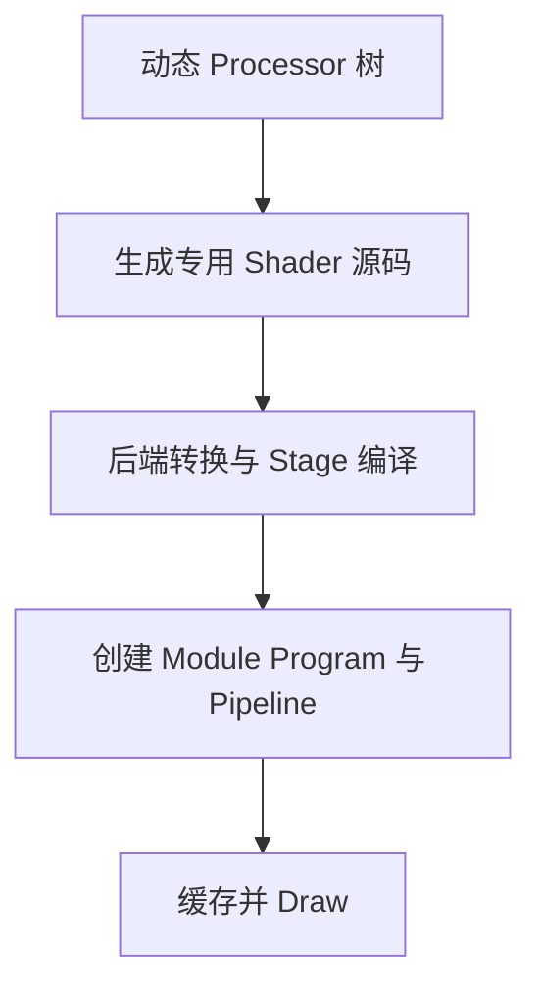
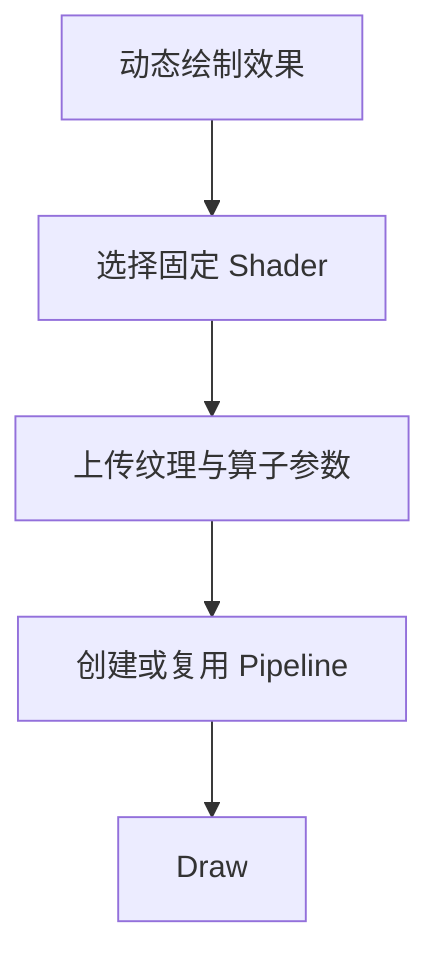
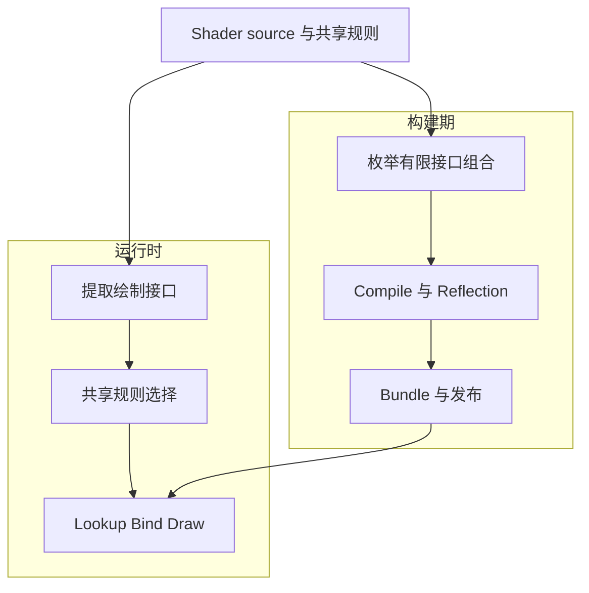
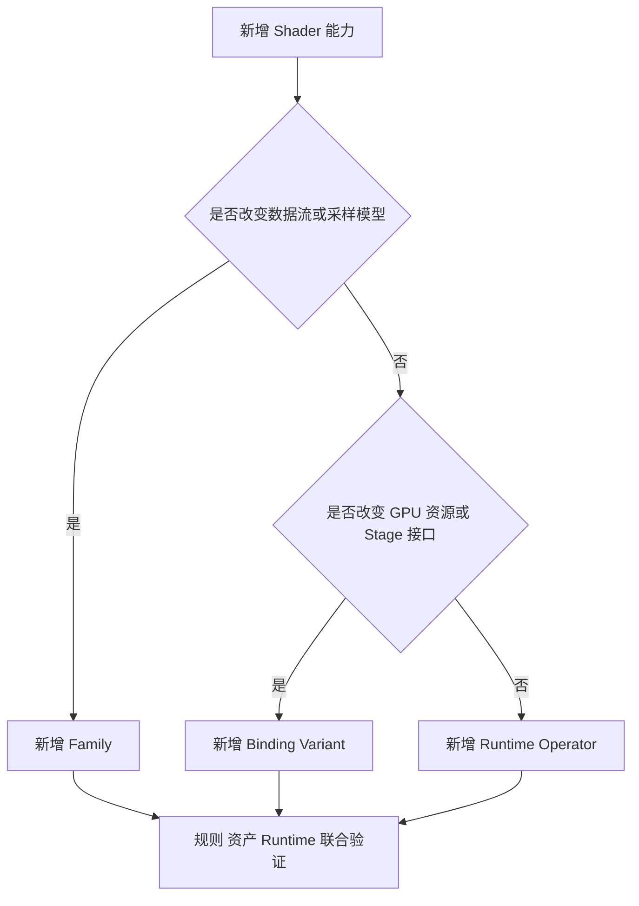

# TGFX 内置 Shader 构建期预编译方案

**文档范围**：TGFX 内置 Shader 的架构、构建资产、运行时路径、部署条件与 JIT 退出条件  
**状态基准**：2026-08-21 的源码、测试与构建清单

---

# 1 方案摘要

## 核心问题

TGFX 依据动态 Processor 树在运行时生成 Shader。缓存只能消除同一程序再次出现时的重复成本，无法覆盖新结构首次出现时的源码生成与编译成本。完整 Processor 树同时包含开放的业务拓扑、GPU 接口和连续参数，也无法在构建期直接穷举。

## 核心解法

采用**构建期固定 Shader + runtime parameterization + finite interface variants + controlled pointwise multi-pass**。固定代码骨架在构建期生成并编译，运行时仅选择资产、上传参数并创建或复用后端对象；程序集合只随有限 GPU 接口差异增长，超过固定容量的线性同像素链按明确边界分段执行。

## 三个技术要点

1. **运行时确定性**：将 TGFX 源码生成以及 Metal、Vulkan 的 Shader stage 编译移出运行时，使新结构首次出现时不再触发这两类工作。
2. **程序空间有限化**：只为 GPU 接口差异生成有限变体；Matrix、Threshold、运算类型等业务参数以运行时数据表达，避免程序集合随完整业务树组合增长。
3. **成本可量化**：包体、构建时间、固定骨架 GPU 成本与 multi-pass 成本均可测量，并作为显式发布成本记录，而非不可见的运行时波动。

## 当前已完成与仍需补充

| 状态 | 范围 | 技术事实或补充条件 |
|---|---|---|
| **已完成** | 构建期预编译架构链路 | 已形成固定 Shader、运行时参数化、有限接口变体和受控分段的完整职责模型 |
| **已完成** | 资产与运行时链路 | 已具备资产生成、反射、打包、运行时选择与来源统计能力 |
| **已证明** | 指定 Metal 基础链与三算子分段案例 | AOT 对 JIT 参考结果 byte-exact；基础链无中间纹理，三算子使用一次 RGBA8 物化 |
| **仍需补充** | 产品全量验证 | 产品覆盖率、包体、构建、加载、CPU 与 GPU 数据需按发布配置验收 |
| **仍需补充** | JIT 退出条件 | 目标语料需达到结构、资产、模块与 Pipeline 零缺口 |
| **仍需补充** | 跨产品、跨设备、跨后端的综合数据 | OpenGL 仍有驱动 compile/link；WebGPU 链路尚未闭合；发布成本与设备性能需实测 |

---

# 2 动态生成使首次成本不可预测，因此必须改变程序获得方式（Why Change）

## 缓存降低重复成本，但不消除新结构的首次成本



**图示结论**：缓存位于程序产生之后；任一新结构仍需经过源码生成及相应后端编译链。

### 动态组合使程序形状由业务结构决定

Processor 的数量、顺序、嵌套与分支由绘制内容决定。运行时不仅上传数据，还解释树结构并据此决定 Shader 代码形状。

### 完整 Processor 树属于开放程序空间

完整树同时包含业务拓扑、GPU 接口和连续参数。若按整棵树预编译，组合数量会随业务结构增长，不能形成稳定且可审计的发布集合。

### Cache 无法消除首次出现的成本

Cache 能复用已经生成并创建的程序，但不能预先覆盖从未出现的结构。首次帧、长尾场景和内容变化仍可能触发源码生成、Stage 编译或 Pipeline 创建。

### 后端差异决定可移出的成本并不相同

- Metal 与 Vulkan 可直接发布构建期 Stage 资产，从运行时移除 TGFX 源码生成及 Stage 源码编译。
- OpenGL 可发布固定 GLSL，从运行时移除 Processor 树展开与 TGFX 源码生成，但驱动仍执行 compile/link。
- Pipeline 状态仍受 Render Target、blend、depth/stencil、sample count 与 vertex layout 影响，不能由 Stage 资产替代。

**结论**：目标不是扩大运行时缓存，而是改变程序的生产时点与程序空间的建模方式。

---

# 3 固定 Shader 将动态代码问题转化为有限选择与数据上传问题（What Changes）

## 核心变化是固定代码骨架、数据化业务参数、保留有限接口变体

| 对比维度 | Before：运行时专用化 | After：构建期固定化 | 保持不变 |
|---|---|---|---|
| Shader 骨架 | 按完整 Processor 树拼接专用源码 | 从有限固定 Shader 集合中选择 | 颜色公式与执行顺序 |
| 参数 | 参数由各 Processor 写入专用程序 | Matrix、Threshold、运算类型等写入固定 payload | 参数仍可逐 draw 更新 |
| 变体 | 业务拓扑与接口共同扩大程序集合 | 仅 GPU 资源绑定和 Stage 接口差异形成变体 | 必要的 sampler、varying、attribute 差异 |
| Stage | 运行时生成并进入后端编译链 | 构建期编译并随产品发布 | Runtime 仍创建后端对象 |
| Pipeline | 随专用程序在运行时创建和缓存 | 仍按运行时状态创建和缓存 | Render Target、blend、采样数等状态 |
| 合成语义 | Coverage 后按 SrcOver 合成 | Coverage 与 SrcOver 语义不变 | API 输出和混合结果 |

## 一个两算子例子足以说明新旧差异

```text
Texture → Matrix → Threshold(0.25) → SrcOver
```

- **旧方案**：运行时根据这条结构生成一份专用 Shader，再进入后端编译与程序创建。
- **新方案**：选择一份预编译的两槽固定 Shader；`slot 0` 写入 Matrix，`slot 1` 写入 Threshold 及 `0.25`，随后绑定既有 SrcOver 状态。

<table>
<thead><tr><th>Before：代码形状随结构变化</th><th>After：代码形状固定，参数随 Draw 变化</th></tr></thead>
<tbody><tr><td><pre><code>color = sample(texture, coord);
color = applyMatrix(color, matrix);
color = applyThreshold(color, 0.25);
output = color * coverage;</code></pre></td><td><pre><code>color = sample(texture, coord);
for (slot = 0; slot &lt; 2; ++slot) {
  color = applyOperator(slot, color);
}
output = color * coverage;</code></pre></td></tr></tbody>
</table>

<table>
<thead><tr><th>Before：运行时产生程序</th><th>After：运行时选择资产并上传数据</th></tr></thead>
<tbody><tr><td><pre><code>source = generate(processorTree);
stages = compile(source);
program = create(stages);</code></pre></td><td><pre><code>artifact = lookup(interfaceKey);
writeSlot(0, matrix);
writeSlot(1, threshold, 0.25);
program = create(artifact);</code></pre></td></tr></tbody>
</table>



**图示结论**：运行时保留效果选择和数据更新，但不再根据业务树生成新的 Shader 代码。

## 三个正式术语界定职责边界

| 自然语言 | 正式术语 | 定义 |
|---|---|---|
| 执行单元 | Render Plan / Pass | 描述有序绘制单元及其依赖和中间结果 |
| 固定接口 | Pass ABI | 规定 Shader 接口、资源布局和参数 payload |
| 预编译 Stage | Artifact | 可创建 Vertex 或 Fragment stage/module 的构建期资产，不是 PSO |

---

# 4 有限接口、共享规则与语义验证共同证明方案可行（Why It Works）

## 有限性来自 GPU 接口，而非业务参数取值

GPU 接口变化主要来自 sampler、varying、vertex attribute、Coverage 接口和阶段职责。这些维度可枚举。Matrix 数值、Threshold 数值及固定算子类型不会改变资源接口，可作为运行时数据承载。由此，程序空间从“完整业务树组合”收敛为“有限接口变体 × 运行时参数”。

## 一致性来自构建期与运行时共享选择规则

构建期用规则枚举合法 Vertex/Fragment 组合并生成资产；运行时从绘制结构提取同类输入，并使用同一组合规则得到资产键。共享规则消除两套独立映射，但结构匹配范围仍需由产品语料验证。



**图示结论**：构建期负责证明资产闭包，运行时负责证明实际绘制只选择已发布资产；两者以共享规则和资产键衔接。

## 语义一致性由不变契约与像素证据共同保证

- 上层绘制 API 不变，动态 Matrix 与 Threshold 参数能力不变。
- Texture、Coverage 与 SrcOver 的执行顺序不变；SrcOver 继续由固定功能混合承担。
- 固定 Shader 复用同一颜色公式，不以近似公式换取有限性。
- 指定 Metal 基础链与三算子分段案例的 AOT 输出相对 JIT 参考结果 byte-exact。

这些证据证明已覆盖案例的实现等价，不代表所有产品结构、格式、设备和后端已通过验收。语义结论必须与适用前提和证据范围同时记录。

---

# 5 三类开发职责与受控分段形成可执行的工程体系（How It Works）

## 新能力应按接口影响分为 Family、binding variant 或 runtime operator



**图示结论**：只有接口或执行拓扑变化才增加编译空间；数值和固定骨架可表达的运算应保持数据化。

| 任务类型 | 判定条件 | 开发责任 | 核心验证 |
|---|---|---|---|
| 新 Family | 数据流拓扑、采样模型或阶段职责变化 | 模板、执行节点、匹配规则、组合规则、枚举范围 | 结构合法性、资产闭包、像素、性能 |
| Binding variant | sampler、varying、attribute 或其他 GPU 接口变化 | 扩展有限维度、模板接口条件和选择输入 | Vertex/Fragment ABI 与后端对象创建 |
| Runtime operator | 固定骨架可表达且不改变资源接口 | opcode、payload、数据写入和固定 Shader 分支 | 公式、顺序、边界值与 GPU 成本 |

## 工具链将资产缺失和 ABI 漂移提前为构建失败

| 阶段 | 输入 | 输出 | 失败条件 |
|---|---|---|---|
| 声明与规则 | Shader source、Family、接口维度、共享规则 | 可达组合清单 | 未注册、索引越界、镜像接口不一致 |
| Compile | 可达组合、backend profile | Metal library、SPIR-V 或固定 GLSL | 任一目标 Stage 编译失败 |
| Reflection | 编译产物与接口声明 | uniform、array、sampler 元数据 | 反射布局与声明不一致 |
| Bundle | Stage、reflection、版本与来源信息 | 后端发布资产 | 缺项、边界、压缩或闭包失败 |
| Runtime lookup | 绘制结构、共享规则、Bundle | Artifact 与绑定布局 | 匹配、资产、module 或 pipeline 任一层缺失 |
| CI evidence | audit、构建、运行与像素结果 | 可复核证据集 | 来源不明、版本不一致或超过验收阈值 |

Bundle、运行时 schema、选择规则和嵌入资产必须同批构建并原子发布。CI 应保存 source hash、工具链版本、backend profile、可达集合、Stage 编译日志、闭包报告和运行时 provenance，使发布结果可追溯。

## 超过固定容量的线性同像素链可受控分为多个 Pass

将基础例子的两项颜色运算扩展为三项：

```text
Texture → Matrix A → Luma → Matrix B → SrcOver
```

| 项目 | 单专用 Shader | 固定两槽 Shader 的受控分段 |
|---|---|---|
| Pass 0 | 不单独存在 | Texture + Matrix A + Luma，写入 exact-fit RGBA8 中间纹理 |
| Pass 1 | 不单独存在 | 采样中间纹理 + Matrix B；空槽执行无操作 |
| 中间资源 | 无 | 1 个 RGBA8 纹理 |
| 数据流量 | 无额外离屏流量 | 写 `4WH` bytes + 读 `4WH` bytes |
| 状态变化 | 无额外切换 | 1 次 Render Target switch |

分段算法按原顺序每次装入不超过两个 pointwise operator；非末段物化输出，后段将该输出作为唯一输入。适用范围严格限制为**线性、同像素、apron=0** 的颜色链，不覆盖任意 DAG、blur、卷积、形态学或缩放重采样。

RGBA8 写读会引入明确量化边界。中间纹理采用 exact-fit 分配；整数分配边界不能替代原始浮点设备边界和采样偏移。亚像素一致性必须以 AOT 对 JIT 的像素结果验证，不能仅由 pointwise 属性推导。

实现中使用 LowerGraph、Render Plan、TailProcessor 和精确 Stage 索引完成上述职责；相关类名、固定槽位与索引细节见附录 A、B。

---

# 6 运行时收益可预期，但发布与 GPU 代价必须量化（Economics and Trade-offs）

## 已有证据证明机制成立，尚不足以代表产品收益

| 案例证据 | 基础链：Matrix + Threshold | 三算子链：Matrix A + Luma + Matrix B |
|---|---:|---:|
| Pass | 1 | 2 |
| Intermediate | 0 | 1 个 RGBA8 |
| TGFX runtime Shader generation | 0 | 0 |
| 中间流量 | 0 | 1 次写 + 1 次读，即 `8WH` bytes |
| RT switch | 0 | 1 |
| Metal AOT 对 JIT | byte-exact | byte-exact |

结构清单规模为 **30 个 Family、308 个可达 pair、101 个 Vertex stage + 274 个 Fragment stage = 375 个 logical stage**。这些数字仅描述资产集合规模，不代表覆盖率、包体、构建时间、命中情况或设备性能。

## 收益与代价需要按同一维度成对评估

| 维度 | 预期收益 | 保留成本或新增代价 |
|---|---|---|
| Runtime CPU | 移出 TGFX 源码生成；Metal/Vulkan 同时移出 Stage 源码编译 | module/function 与 Pipeline 仍需创建和缓存 |
| OpenGL 边界 | 移出 Processor 树展开与 TGFX 源码生成 | 驱动 compile/link 仍存在 |
| Fixed skeleton GPU | 程序空间稳定，动态参数不再制造新程序 | opcode 分派、统一 payload、指令与寄存器可能高于专用 Shader |
| Bundle / Build | 资产可审计，缺失组合可在构建期暴露 | 发布包体、Stage 编译时间、CI 资源与加载解压成本增加 |
| Multi-pass | 长线性链无需运行时生成更长专用 Shader | 临时显存、RGBA8 写读、RT switch 与量化边界 |

## 可量化约束覆盖发布成本、运行时收益与产品完整性

| 指标 | 测量内容 | 技术目的 |
|---|---|---|
| Bundle | 各发布后端压缩体积、安装占比、常驻内存 | 控制发布成本 |
| Build | clean/incremental 时间、CI 并发资源、缓存效果 | 控制研发与发布周期 |
| Load | 校验、解压、reflection 解析、峰值内存、失败率 | 控制初始化成本与可靠性 |
| CPU | 首帧、尾延迟、module、Pipeline、binding、参数上传 | 验证运行时确定性与收益 |
| GPU | 指令、寄存器、occupancy、采样、帧耗、功耗 | 限制固定骨架回归 |
| Coverage | 结构匹配、资产、module、Pipeline 与 provenance 缺口 | 证明目标路径完整性 |
| Multi-pass | 真实尺寸临时显存、`8WH` 带宽、RT switch、尾延迟 | 控制分段适用范围 |

本文不引用历史 Bundle size、hit rate 或公式测试计数。所有生产结论必须来自目标产品语料、发布配置和代表设备。

---

# 7 建议分两阶段批准，并以零缺口评审决定 JIT 退出（Recommendation and Roadmap）

## 建议批准与暂不批准的边界应保持明确

| 决策 | 范围 |
|---|---|
| **批准** | 构建期固定 Shader、运行时参数化、有限接口变体的架构方向 |
| **批准** | 以线性 pointwise、apron=0、RGBA8 量化边界为当前 multi-pass 范围 |
| **批准** | 在灰度门禁完成后进入产品验证 |
| **暂不批准** | 生产全量启用 |
| **暂不批准** | 移除 JIT |
| **暂不批准** | 通用 filter、通用 layer 或任意 DAG 分段 |

## 灰度与删除 JIT 必须使用不同门禁

| 门禁类别 | 阶段 A：允许灰度 | 阶段 B：允许删除 JIT |
|---|---|---|
| 资产闭包 | 发布后端的声明组合均有 Vertex/Fragment Artifact | 产品目标语料无未声明或缺失资产 |
| 正确性 | 关键单 Pass 与 multi-pass 案例满足后端像素门限 | 目标语料满足批准的全量误差模型；Metal 关键场景 byte-exact |
| 可观测性 | 可区分匹配、资产、module、Pipeline、JIT 与失败原因 | 目标路径 JIT creation 和各层缺口为零 |
| 发布成本 | Bundle、构建和加载数据已采集并进入预算评审 | 全部指标满足已批准阈值 |
| CPU / GPU | 代表设备完成基线对比 | 首帧、尾延迟、帧耗和功耗满足阈值 |
| Multi-pass | 真实尺寸成本可统计并可限制范围 | 显存、带宽、RT switch 与尾延迟满足预算 |
| 回滚 | 配置可停用 AOT 并恢复迁移期 JIT 参考路径 | 通过版本回滚恢复上一发布，不保留静默运行时生成 |

JIT 只承担迁移期的参考、诊断和缺口暴露职责，不是终态运行机制。删除 JIT 后，资产或后端对象缺失必须作为硬错误处理，并纳入初始化策略、监控和发布回滚。

## 里程碑应按证据依赖顺序推进

1. **产品语料零缺口**：固化目标语料，证明结构匹配、资产、module、Pipeline 和 provenance 闭包。
2. **发布资产与构建验收**：以发布配置测量 Bundle、clean/incremental build、加载和内存。
3. **设备性能验收**：在代表设备分离测量源码生成、module、Pipeline、binding、CPU 与 GPU 成本。
4. **Multi-pass 预算验收**：按真实内容尺寸验证临时显存、带宽、RT switch、量化和尾延迟。
5. **产品灰度**：满足阶段 A 后按产品配置扩大范围，持续记录失败层次与性能分布。
6. **删除 JIT 评审**：阶段 B 全部通过后，单独审批移除运行时 Shader 生成器。

## 每项门禁必须使用统一审批模板

| 字段 | 要求 |
|---|---|
| Owner | 对数据、复现环境和整改负责的单一负责人 |
| Threshold | 预先批准的绝对值或相对基线，不在结果产生后调整 |
| Evidence | 语料版本、设备、OS、backend、构建配置、工具版本、原始日志与报告 |
| Approver | 对产品、渲染、构建或性能预算拥有决策权的审批角色 |

## 回滚策略以资产一致性和可诊断性为原则

- 灰度期由产品配置控制 AOT 范围；Bundle、runtime schema、选择规则和二进制必须原子发布。
- 阶段 A 发现异常时，停用对应灰度范围并恢复迁移期 JIT 参考路径，同时保留明确失败原因。
- JIT 删除后不允许以静默动态生成掩盖资产缺口；异常通过版本回滚恢复上一完整发布。
- WebGPU 在 WGSL 生成、Bundle、runtime load、module/Pipeline 和验证矩阵闭合前不纳入交付承诺。

**最终建议**：批准架构方向、当前 pointwise 边界与灰度准备；生产全量启用和移除 JIT 保持为独立决策，分别由阶段 A、阶段 B 的量化证据触发。

---

# 附录

## A 完整技术链证明主案例如何从 API 映射到固定资产

### A.1 适用前提

| 条件 | 取值 |
|---|---|
| Backend | Metal |
| Source | RGBA Texture2D，单 sampler |
| Transform | 非透视 |
| GP / AA | Quad GP，Coverage AA |
| Coverage FP | 无独立 Coverage FP |
| Blend | `SrcOver`，无需目标纹理 |
| Render Target | Single-sample RGBA8888 |
| AOT 状态 | Bundle loaded，decomposition enabled |

### A.2 API 与原始 ProgramInfo

```cpp
auto filter = ColorFilter::Compose(
    ColorFilter::Matrix(matrix),
    ColorFilter::AlphaThreshold(0.25f));

Paint paint = {};
paint.setColorFilter(filter);
paint.setBlendMode(BlendMode::SrcOver);
canvas->drawImage(image, 0, 0, &paint);
```

```text
API
  → ProgramInfo
      GP: Quad
      ColorFP[0]: TextureEffect
      ColorFP[1]: Compose(ColorMatrix, AlphaThreshold(0.25))
      CoverageFP[]: empty
      XP: EmptyXP with SrcOver fixed-function state
  → LowerGraph
      0 GeometryColor
      1 TextureSource <- 0
      2 ColorMatrix <- 1
      3 AlphaThreshold <- 2
  → Render Plan
      Pass 0: PointwiseTail, nodes=[1,2,3], materializesOutput=false
  → TailProcessor
      slot 0: OP_MATRIX + matrix + bias
      slot 1: OP_ALPHA_THRESHOLD + threshold 0.25
  → permutation v1/f3
  → Metal artifact lookup
  → function/module creation
  → runtime Pipeline lookup or creation
  → bind texture, payload, Coverage and blend state
  → draw
```

### A.3 固定容量与空槽事实

`PointwiseTail` 的固定容量是 `MaxSlots = 2`。Shader 源码保留 slot count uniform，但 C++ 每次上传的值固定为 `MaxSlots`，所以 Shader 固定执行两槽。少于两个算子时，空槽上传 `OP_NONE` 和空 payload；不能描述为按有效算子数量缩短循环。

主案例两槽均有效：`slot 0 = Matrix`，`slot 1 = AlphaThreshold(0.25)`。Matrix 按 unpremul → 4×4 transform + RGBA bias → clamp → premul 执行；Threshold 返回完整 RGBA，不只覆盖 alpha。

`SrcOver` 不占 operator slot。该条件下 XP 为 `EmptyXP`，Fragment 输出经 Coverage 后交给 fixed-function blend。精确选择结果为 `PointwiseTail v1/f3`。

### A.4 构建期与运行时选择伪代码

<table>
<thead><tr><th>构建期</th><th>运行时</th></tr></thead>
<tbody><tr><td><pre><code>for inputs in EnumeratePointwiseTailInputs():
  values = ComposePointwiseTail(inputs)
  if values is invalid:
    continue
  pair = encode(values.vert, values.frag)
  stages = compileForBackend(pair)
  bundle.add(hash(pair), stages, reflection)</code></pre></td><td><pre><code>graph = LowerGraph(programInfo)
plan = Decompose(graph)
inputs = ExtractPointwiseTailInputs(plan)
values = ComposePointwiseTail(inputs)
pair = encode(values.vert, values.frag)
artifact = bundle.find(hash(pair))
pipeline = createOrFindPipeline(artifact, state)
bindAndDraw(pipeline, payload)</code></pre></td></tr></tbody>
</table>

共享 Compose 保证给定 Inputs 后的维度映射一致；它不替代 runtime matcher 对单 sampler、纹理类型、透视、Coverage FP、XP 和其他结构前提的验证。

## B PointwiseTail、PointwiseChain 与 ABI 判据界定变体边界

| 特性 | PointwiseTail | PointwiseChain |
|---|---|---|
| 主结构 | 单纹理源后的线性一元颜色链 | 多纹理或常量叶组成的 pointwise DAG |
| 数据流 | 严格顺序 | slot 携带输入索引与 root index |
| 纹理叶 | 1 | 受固定 sampler 容量约束 |
| 算子容量 | 每 Pass 固定 2 slots | 固定最大 slots，可表达分支与 Blend |
| 代表结构 | `Texture→Matrix→AlphaThreshold` | 多叶纹理或常量的分支合成 |
| 分段边界 | 超过 2 slots 的线性链可 multi-pass | 不执行通用 DAG multi-pass 切分 |

两个顺序算子属于 `PointwiseTail`，不构成 `PointwiseChain`。

### ABI 判据

| 变化 | 是否增加 permutation | 处理方式 |
|---|---:|---|
| Matrix 或 Threshold 数值变化 | 否 | runtime payload |
| 固定 operator 类型变化 | 否，骨架已支持时 | opcode + payload |
| Uniform payload layout 变化 | 通常否 | 同步 C++、Shader、reflection 与 Bundle ABI，并重建资产 |
| sampler 数量或类型变化 | 是 | binding variant 或新 Family |
| varying / vertex attribute 变化 | 是 | binding variant |
| 数据流拓扑或阶段职责变化 | 是 | 新 Family |

变体判据是 GPU 资源绑定与 Stage interface 是否改变，而不是单测是否使用某个组合。

## C 后端矩阵明确 AOT 能消除与不能消除的工作

| Backend | 构建期最终资产 | Runtime TGFX 源码生成 | Runtime Shader 编译 | Runtime Pipeline creation | 交付状态 |
|---|---|---:|---:|---:|---|
| Metal | metallib | 无 | 无源码编译；从二进制创建对象 | 有 | 路径已接入，产品门禁待完成 |
| Vulkan | SPIR-V | 无 | 无 GLSL→SPIR-V；创建 module | 有 | 路径已接入，产品门禁待完成 |
| OpenGL | 固定 GLSL | 无树展开与源码生成 | 有，驱动 compile/link | 有 | 路径已接入，闭包、像素和性能待验收 |
| WebGPU | WGSL 尚未生成 | 不适用 | 不适用 | 不适用 | 链路未闭合，未交付 |

Artifact 是 Vertex/Fragment Stage 资产，不是 Pipeline State Object。Render Target 格式、blend、depth/stencil、sample count 和 vertex layout 仍参与运行时 Pipeline 创建与缓存。

## D Bundle v4、Zstd 与 Reflection 提供可发布的 Stage 资产

Bundle 按 Vertex/Fragment stage pool 组织，不按 pair 保存完整 Pipeline：

```text
Header
  magic / format version / compression type
  source hash / toolchain version / backend profile
  vertex pool metadata / fragment pool metadata
  data size / reflection offset
Vertex Pool Entries
Fragment Pool Entries
Stage Data Pool
Reflection Pool
```

Writer 生成 Bundle v4；Loader 兼容 v3 与 v4，v4 reflection entry 增加 `arraySize`。生产构建使用 Zstd 压缩 Stage data pool，Loader 兼容历史 zlib Bundle；Reflection pool 不在该压缩 data pool 内。

Pool entry 通过 stage key hash、blob offset、blob size 和 reflection offset 定位。Loader 校验 header、版本、压缩类型和边界，解压后建立 Vertex/Fragment hash map。Reflection 记录 uniform 名称、格式、数组长度和 sampler，运行时据此构造 `UniformData`、UBO binding 和 sampler layout。

## E 命令与 CI 形成构建、闭包、来源和像素证据

```bash
# Build embedded bundles for configured backends.
tgfx_shader_bundles

# Generate reachable-set and size reports without compiling stages.
shader_build_tool --report-only ...

# Audit pair indices and mirrored Vertex/Fragment interfaces.
shader_build_tool --audit ...

# Generate a Zstd-compressed bundle.
shader_build_tool --compress ...
```

| CI 阶段 | 阻断条件 | 归档证据 |
|---|---|---|
| 声明与规则 | Family 无 enumerator、audit violation、pair 越界 | audit 日志与可达集合 |
| Stage 编译 | 任一目标 backend Stage 编译失败 | backend 编译日志 |
| Bundle | 写入、压缩、嵌入或 closure 失败 | Bundle、header 摘要、closure 报告 |
| Runtime | module/Pipeline failure 或非预期 JIT provenance | 分层 AOT 运行报告 |
| 像素 | AOT 与参考路径超过批准误差 | 输出图、差异报告、原始日志 |

AOT 命中必须同时满足 cache loaded、matcher success、Vertex/Fragment artifact present、module creation success、Pipeline creation success，且最终 Program provenance 为 `PrecompiledArtifact`。仅统计 matcher success 不能证明绘制未进入 JIT。

## F 代码索引与数据口径限定证据范围

### F.1 代码索引

| 主题 | 代码位置 |
|---|---|
| JIT GP → FP[] → XP 顺序 | `src/gpu/ProgramBuilder.cpp:41` |
| FP 遍历与递归入口 | `src/gpu/ProgramBuilder.cpp:77` |
| Cache、AOT 与 JIT 选择 | `src/gpu/ProgramInfo.cpp:177` |
| 结构 Lower | `src/gpu/AOTEffectDecomposer.cpp:72` |
| 融合 Validate | `src/gpu/AOTEffectDecomposer.cpp:107` |
| PointwiseTail 分段 | `src/gpu/AOTEffectDecomposer.cpp:151` |
| OpsCompositor 路由 | `src/gpu/OpsCompositor.cpp:1158` |
| PointwiseTail 容量 | `src/gpu/processors/AOTPointwiseTailProcessor.h:35` |
| PointwiseTail payload 上传 | `src/gpu/processors/AOTPointwiseTailProcessor.cpp:134` |
| Pass processor 构建 | `src/gpu/AOTPlanExecutor.cpp:865` |
| Multi-pass 坐标与 apron | `src/gpu/AOTPlanExecutor.cpp:1200` |
| Exact-fit 分配 | `src/gpu/AOTMaterializationPolicy.cpp:72` |
| PointwiseTail 声明 | `src/gpu/shaders/level1/PointwiseTailShader.h:25` |
| PointwiseTail 固定骨架 | `src/gpu/shaders/glsl/level1/pointwise_tail.frag:16` |
| PointwiseTail 共享规则 | `src/gpu/shaders/PermutationRules.cpp:919` |
| Runtime matcher | `src/gpu/PermutationMatcher.cpp:620` |
| Artifact lookup 与 Program 创建 | `src/gpu/PrecompiledProgramCreator.cpp:185` |
| Bundle 加载 | `src/gpu/PrecompiledShaderCache.cpp:520` |
| Bundle 自动加载 | `src/gpu/Context.cpp:52` |
| 构建清单与后端编译 | `tools/shader_build_tool/main.cpp:340` |
| Reflection 提取 | `tools/shader_build_tool/ReflectionExtractor.cpp:125` |
| WGSL 未实现 | `tools/shader_build_tool/ShaderCompiler.cpp:178` |
| 结构 audit | `tools/shader_build_tool/main.cpp:572` |
| 基础链像素测试 | `test/src/AOTRenderConsistencyTest.cpp:1020` |
| 分段链证据 | `test/src/AOTRenderConsistencyTest.cpp:980` |

### F.2 数据口径

- **Family = 30**：注册并参与可达集枚举的 Shader Family 数。
- **Pairs = 308**：所有 Family 的可达 `(vertPermutationIndex, fragPermutationIndex)` 总数。
- **101V + 274F = 375 stages**：pair 分别投影并按 stage key 合并后的 logical stage entries。
- **Audit 30/30，0 violations**：全部已注册 Family 完成结构审计，未发现越界或镜像维度不一致。
- **Runtime Shader generation = 0**：指定测试中 `ProgramBuilder` creation 为零；不表示 OpenGL 驱动不编译 GLSL。
- **Metal byte-exact**：指定案例在 Metal 上 AOT 与 JIT 参考逐字节一致，不外推其他设备、后端、格式或产品语料。
- **`4WH` / `8WH`**：RGBA8 中间纹理单向传输为 `4WH` bytes，一写一读为 `8WH` bytes。
- **Bundle size、构建时间、hit rate**：不使用历史数值，必须以发布配置和目标产品语料重新测量。
